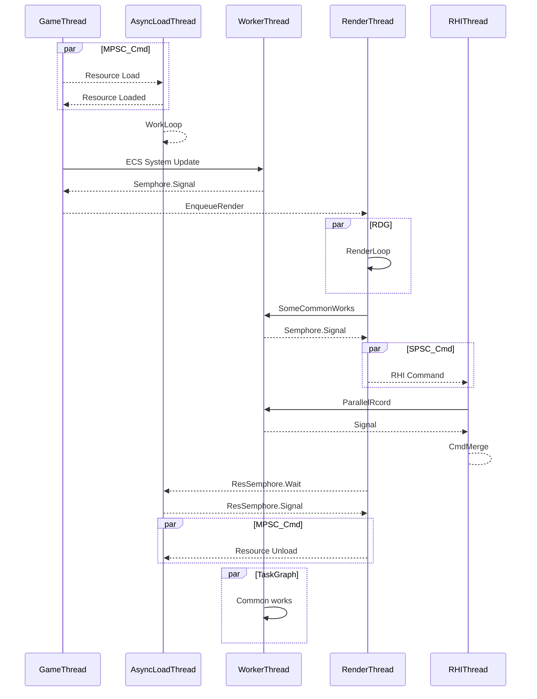

```mermaid
sequenceDiagram
    participant GameThread
    participant AsyncLoadThread
    participant WorkerThread
    participant RenderThread
    participant RHIThread

    par MPSC_Cmd
        GameThread-->>AsyncLoadThread: Resource Load 
        AsyncLoadThread-->>GameThread: Resource Loaded
    end

    AsyncLoadThread-->>AsyncLoadThread: WorkLoop

    GameThread->>WorkerThread: ECS System Update
    WorkerThread -->> GameThread: Semphore.Signal

    GameThread-->>RenderThread: EnqueueRender

    par RDG
        RenderThread->>RenderThread: RenderLoop
    end

    RenderThread->>WorkerThread: SomeCommonWorks
    WorkerThread-->>RenderThread: Semphore.Signal

    par SPSC_Cmd
        RenderThread-->>RHIThread: RHI Command 
    end

    RHIThread->>WorkerThread: ParallelRcord
    WorkerThread-->>RHIThread: Signal
    RHIThread-->RHIThread: CmdMerge


    RenderThread-->>AsyncLoadThread: ResSemphore.Wait
    AsyncLoadThread-->>RenderThread: ResSemphore.Signal
    par MPSC_Cmd
        RenderThread-->>AsyncLoadThread: Resource Unload 
    end

    par TaskGraph
        WorkerThread->>WorkerThread: Common works
    end

```
