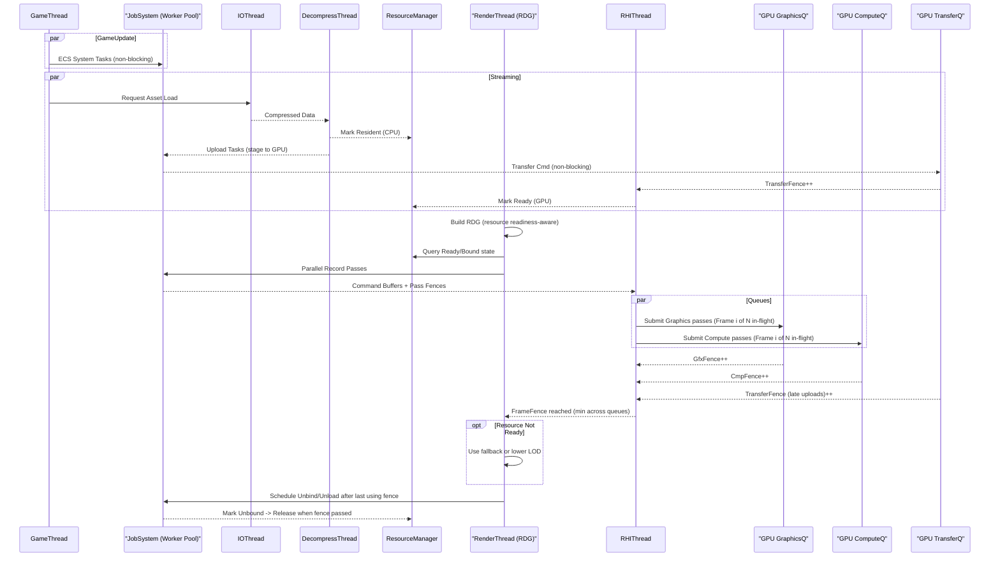

```mermaid
sequenceDiagram
    participant Game as GameThread
    participant Jobs as "JobSystem (Worker Pool)"
    participant IO as IOThread
    participant DC as DecompressThread
    participant Res as ResourceManager
    participant Render as "RenderThread (RDG)"
    participant RHI as RHIThread
    participant GfxQ as "GPU GraphicsQ"
    participant CmpQ as "GPU ComputeQ"
    participant XferQ as "GPU TransferQ"


    par GameUpdate
        Game->>Jobs: ECS System Tasks (non-blocking)
    end

    par Streaming
        Game->>IO: Request Asset Load
        IO-->>DC: Compressed Data
        DC-->>Res: Mark Resident (CPU)
        DC-->>Jobs: Upload Tasks (stage to GPU)
        Jobs-->>XferQ: Transfer Cmd (non-blocking)
        XferQ-->>RHI: TransferFence++
        RHI-->>Res: Mark Ready (GPU)
    end

    Render->>Render: Build RDG (resource readiness-aware)
    Render->>Res: Query Ready/Bound state
    Render->>Jobs: Parallel Record Passes
    Jobs-->>RHI: Command Buffers + Pass Fences

    par Queues
        RHI->>GfxQ: Submit Graphics passes (Frame i of N in-flight)
        RHI->>CmpQ: Submit Compute passes (Frame i of N in-flight)
    end

    GfxQ-->>RHI: GfxFence++
    CmpQ-->>RHI: CmpFence++
    XferQ-->>RHI: TransferFence (late uploads)++

    RHI-->>Render: FrameFence reached (min across queues)

    opt Resource Not Ready
        Render->>Render: Use fallback or lower LOD
    end

    Render->>Jobs: Schedule Unbind/Unload after last using fence
    Jobs-->>Res: Mark Unbound -> Release when fence passed
```
