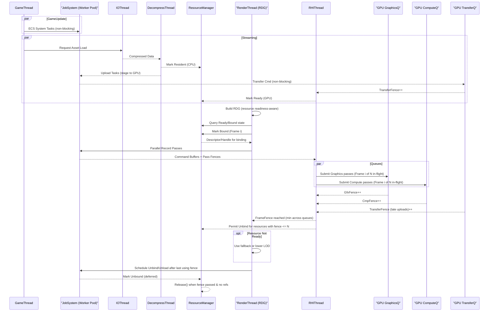

### 关键说明
- **Non-blocking Unbind/Unload**: `Render->>Jobs: Schedule Unbind/Unload` 不在 Job 内等待 fence。Job 仅入队“延后释放”记录并立即返回，由后台回收器或主循环在 timeline fence 达成后执行真正的 Unbind/Release。
- **资源状态语义**:
  - **Resident**: 资源已在 CPU 内存或磁盘缓存中，可被上传。
  - **Ready**: 数据已上传到 GPU，可被渲染绑定。
  - **Bound**: 本帧/本 pass 被 RDG 绑定使用；需要记录“最后使用的 GPU fence 值”。
- **在飞帧数**: 队列提交包含“Frame i of N in-flight”，`FrameFence` 为各队列 fence 的最小值，用于驱动帧级资源回收。
- **禁止阻塞**: Render/Job 都不阻塞等待 CPU 同步；等待仅发生在 GPU fence 查询（非阻塞读取或轻量轮询）。

- **回收器运行位置**:
  - 推荐运行在 `RHIThread`：RHI 最了解各队列的 fence 完成度，能及时触发回收；回收逻辑须短小不可阻塞，重操作（如大内存释放或磁盘写）应投递回 `JobSystem` 低优先级处理。
  - 备选：独立 `Reclaimer` 线程周期查询统一的 `TimelineFence` 视图；优点是与 RHI 解耦，缺点是多一处轮询。
  - 也可将回收做成 `JobSystem` 的周期任务（低优先级），确保不会与录制任务抢占关键核心。

### 具体实现方式（示例）
```cpp
// 记录需要在 GPU 使用完成后释放的资源
struct PendingRelease { ResourceId id; uint64_t lastUseFence; };
LockFreeQueue<PendingRelease> releaseQueue;

// 调度阶段（不阻塞）：记录最后使用的 fence 值
void scheduleUnbind(ResourceId id, uint64_t fenceValue) {
    releaseQueue.push({ id, fenceValue });
}

// 回收器（建议在 RHI 线程或专用 Reclaimer 线程循环）
void reclaimLoop(TimelineFence& timelineFence) {
    for (;;) {
        uint64_t done = timelineFence.completed(); // Vulkan timeline 或 D3D12 fence
        PendingRelease pr;
        while (releaseQueue.try_peek(pr) && pr.lastUseFence <= done) {
            releaseQueue.try_pop(pr);
            resourceManager.markUnbound(pr.id);
            resourceManager.releaseIfUnused(pr.id);
        }
        sleep_for(1ms);
    }
}
```

实现要点：
- **记录最后使用的 fence**：在 RDG 编译或提交时，为每个被绑定的资源写入本帧对应队列的 fence 值。
- **回收职责单点化**：由 `ResourceManager` 统一判定 Unbound/Release，避免多线程重复释放。
- **跨 API 统一**：Vulkan 用 timeline semaphore；D3D12 用 fence + signal 值，抽象为 `TimelineFence` 接口。

### 资产资源 vs GPU 资源的分层
- **AssetManager（资产层）**:
  - 管 Mesh/Texture 等“内容资源”的生命周期、引用计数、LOD/Streaming、CPU 缓存与解压。
  - 生成上传任务，但不直接持有驱动对象；以 `AssetHandle` 标识，映射到一个或多个 GPU 物化体。
- **GPUResourceManager（驱动层）**:
  - 管 `VkImage/VkBuffer/VkImageView/Descriptor/DeviceMemory` 等对象、子分配/别名与绑定句柄。
  - 生命周期与“提交完成度”绑定：以 `SubmissionId{queue, fence}` 表示“最后一次使用”。
  - 提供 `BindlessHandle/Descriptor` 给渲染绑定，支持 Ready/Bound/Unbound/Release 状态机。

两层解耦：资产释放 → 触发 GPU 层按最后使用的 `SubmissionId` 延后回收；GPU 层可因内存压力提前做 aliasing/evict，而不影响资产的逻辑存在。

### Submit 粒度的回收（不在每次 submit 执行 GC）
- **核心思路**：提交时仅记录“完成后可回收”的资源到按 fence 值分桶的数据结构；由回收器按时间片/阈值批量处理，避免每次 submit 即做 GC。

- **做法 A：Epoch Ring（按 fence 分桶）**
  - 为每个队列维护 `buckets[epoch]`，`epoch == fenceValue`（可按窗口取模实现环形缓冲）。
  - 释放请求入桶：O(1)；当 `completedFence` 前进到 `F` 时，批量清空 `<=F` 的桶。
  - 单次回收受时间预算/数量阈值限制，避免抖动。

```cpp
enum class QueueType { Graphics, Compute, Transfer };
struct SubmissionId { QueueType queue; uint64_t fence; };

struct ReleaseBuckets {
    uint64_t baseFence = 0;                // 最老未回收的 fence 值
    std::deque<std::vector<ResourceId>> buckets; // 环形：buckets[i] 对应 baseFence + i
    size_t window = 1024;                  // 窗口大小，可动态扩容

    void enqueue(ResourceId id, uint64_t fence) {
        if (fence < baseFence) return; // 已完成，直接交给即时释放路径
        size_t idx = size_t(fence - baseFence);
        if (idx >= buckets.size()) buckets.resize(std::max(window, idx + 1));
        buckets[idx].push_back(id);
    }

    // 批量回收到 completedFence，带时间预算
    void reclaim(uint64_t completedFence, double msBudget) {
        auto start = now_ms();
        while (baseFence <= completedFence && !buckets.empty()) {
            for (auto id : buckets.front()) {
                resourceManager.releaseIfUnused(id);
                if (now_ms() - start > msBudget) return; // 时间切片
            }
            buckets.pop_front();
            baseFence++;
        }
    }
};
```

—

#### Overdue 桶处理（窗口外的大 fence 值）
当 `fence - baseFence` 远大于 ring 窗口时，如果直接扩容 `buckets` 会造成内存浪费。解决思路：将窗口外条目放入按 fence 值排序的“过期堆（min-heap）”，在完成度推进到相应值时再批量释放。

策略要点：
- **入队**：若 `fence - baseFence >= window`，不要扩容 ring，改为入 `overdueMinHeap`。
- **回收顺序**：先清 `ring` 中 `<= completedFence` 的桶，再从 `overdueMinHeap` 依 fence 升序弹出 `<= completedFence` 的条目。
- **滑动窗口**：在 reclaim 结束后，可根据 `baseFence` 与 `completedFence` 的距离适度收缩/平移窗口，避免 buckets 长期膨胀。
- **预算控制**：对 overdue 释放同样套用时间/数量预算以防抖动。

扩展实现示例：
```cpp
struct OverdueItem { uint64_t fence; ResourceId id; };
struct ByFenceAsc { bool operator()(const OverdueItem& a, const OverdueItem& b) const { return a.fence > b.fence; } };
using OverdueMinHeap = std::priority_queue<OverdueItem, std::vector<OverdueItem>, ByFenceAsc>;

struct ReleaseBucketsWithOverdue {
    uint64_t baseFence = 0;
    size_t window = 1024;
    std::deque<std::vector<ResourceId>> buckets;
    OverdueMinHeap overdue;

    void enqueue(ResourceId id, uint64_t fence) {
        if (fence < baseFence) { resourceManager.releaseIfUnused(id); return; }
        const uint64_t delta = fence - baseFence;
        if (delta >= window) { overdue.push({ fence, id }); return; }
        const size_t idx = size_t(delta);
        if (idx >= buckets.size()) buckets.resize(window);
        buckets[idx].push_back(id);
    }

    void reclaim(uint64_t completedFence, double msBudget, size_t countBudget = SIZE_MAX) {
        const auto start = now_ms();
        size_t released = 0;

        // 1) 先清 ring
        while (baseFence <= completedFence && !buckets.empty()) {
            for (auto id : buckets.front()) {
                resourceManager.releaseIfUnused(id);
                if (++released >= countBudget) return;
                if (now_ms() - start > msBudget) return;
            }
            buckets.pop_front();
            buckets.emplace_back(); // 维持固定窗口大小
            baseFence++;
        }

        // 2) 再清 overdue（按 fence 升序）
        while (!overdue.empty() && overdue.top().fence <= completedFence) {
            auto it = overdue.top(); overdue.pop();
            resourceManager.releaseIfUnused(it.id);
            if (++released >= countBudget) return;
            if (now_ms() - start > msBudget) return;
        }
    }
};
```

可选优化：
- **过量保护**：当 `overdue.size()` 超过阈值时，分批提前清理最老 N% 的条目（仍受预算约束），避免堆爆。
- **合并记录**：同一资源多次 enqueue 仅保留最大 fence（用哈希表去重），避免重复释放。
- **多队列隔离**：为 Gfx/Compute/Transfer 分别维持 ring 与 overdue，使用各自的 `completedFence`。

- **做法 B：完成事件队列 + 阈值触发**
  - 每次 submit 仅将 `SubmissionId` 入无锁队列；回收器以“累计提交数、待回收资源数、累计占用字节或定时器”作为触发条件，批量查询 `completedFence`，并释放对应资源。
  - 适合提交频繁但单次资源数量很少的场景。

- **查询完成度**：
  - Vulkan：每个队列 1 个 timeline semaphore；提交 signal 递增值；CPU 用 `vkGetSemaphoreCounterValue` 读取完成值。
  - D3D12：每个队列 1 个 `ID3D12Fence`；`Signal(value)` 后用 `GetCompletedValue()` 查询。

- **放置与调度**：
  - 回收器建议在 `RHIThread` 或独立 `Reclaimer` 线程以固定周期/阈值运行；或在渲染帧尾执行一次“轻量 sweep”，重回收留给后台线程。
  - 对超大释放操作（大页内存、庞大描述符批量销毁）可分批切片，或让 JobSystem 低优先级异步处理，避免阻塞 RHI 提交。
