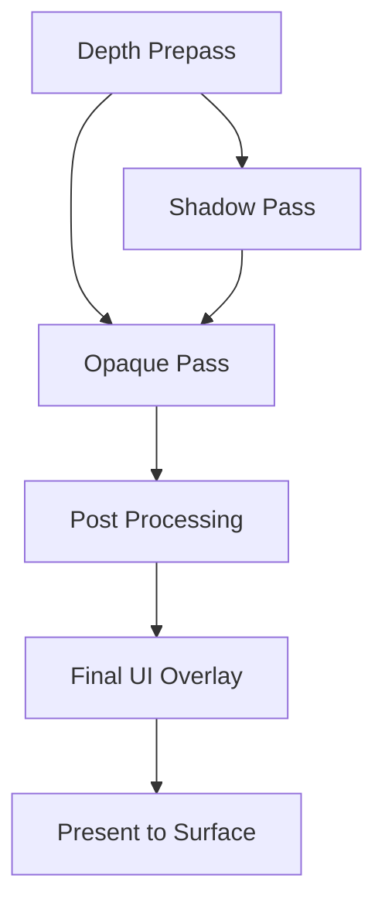
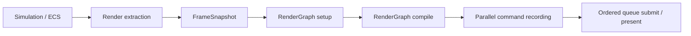

# Architecture Spec: Rendering & RenderGraph

Arisen Engine uses a **RenderGraph** architecture based on a **Directed Acyclic Graph (DAG)** to manage rendering operations. This system decouples the "what" of rendering (passes, dependencies, resources) from the "how" (GPU command submission, synchronization).

---

## 1. Core Packages

The rendering stack is composed of three primary layers:

1.  **`com.arisen.dag`**: The generic library for managing node dependencies and topological sorting.
2.  **`com.arisen.rendering`**: The core package providing the `RenderGraph` infrastructure, the `RenderPipeline` base class, and shared resource management.
3.  **`com.arisen.generic-renderpipeline`**: The baseline implementation package that provides standard passes (Clear, Geometry, etc.) for common rendering tasks.
4.  **`com.arisen.rhi.vulkan.native`**: The native driver that translates the `RenderGraph`'s compiled passes into specialized Vulkan command buffers.

---

## 2. The RenderGraph Pattern

Unlike traditional "Forward" or "Deferred" pipelines that are hard-coded, the Arisen RenderGraph is built dynamically at runtime:

### Nodes as Passes
A `RenderPass` in Arisen is a node in the DAG. Each pass declares:
-   **Inputs**: The textures or buffers it needs to read from.
-   **Outputs**: The textures or buffers it will write to.

### Automatic Optimization
Because the engine knows the entire graph, it can perform several high-end optimizations automatically:
1.  **Resource Aliasing**: If two textures are never used at the same time, they can share the same physical GPU memory.
2.  **Automatic Barriers**: The graph automatically inserts `VkBarrier` or `PipelineBarrier` calls when an output of one node is used as an input for another.
3.  **Culling**: If a pass produces an output that is never consumed by the final display pass, that entire node (and its dependencies) is culled from the execution array.

### RenderPipeline Orchestration
The `RenderPipeline` base class manages the lifecycle of the `RenderGraph`. Instead of manual rendering loops, developers override `SetupGraph()` to register their passes.
```csharp
protected override void SetupGraph(RenderGraph graph, RenderContext context)
{
    ReadOnlySpan<Camera> cameras = context.Cameras;
    graph.AddPass(new MyCustomPass());
}
```

---

## 3. Data-Driven Workflow

Render pipelines are defined as **RenderPipelineAssets**. These assets describe the graph structure.



### Generic Render Pipeline
The `com.arisen.generic-renderpipeline` package provides a baseline implementation that users can extend. It allows for:
-   **Custom Passes**: Users can inject their own `RenderPass` nodes into the existing graph via the `ServiceRegistry`.
-   **Parallel Construction**: The pipeline resolves the global `ITaskGraph` from the kernel to enable parallel command recording across multiple CPU cores.
-   **Runtime Modification**: The graph can be re-compiled dynamically if rendering settings change (e.g., enabling/disabling SSAO or Volumetric Fog).

---

## 4. Multi-Threading (TaskGraph)

Rendering execution is integrated with the `com.arisen.taskgraph` job system. 
-   **Command Recording**: Multiple render passes can record their native command buffers in parallel across different CPU cores.
-   **Submission**: The `RenderSubsystem` collects these buffers and submits them to the GPU queue in the correct topological order.

Current implementation:
- `RenderPipeline` owns a reusable `RenderGraph`.
- `RenderGraph` compiles pass dependencies into parallel layers.
- `RenderGraph` caches the compiled topology as pass-node ids and parallel-layer ids when the graph signature is stable, so steady-state frames can skip the DAG compiler while still resolving the current frame's pass instances.
- The generic DAG compiler reports dependency cycles with remaining node/edge context, and RenderGraph wraps compile failures with render pass graph state.
- RenderGraph validates that declared resources belong to the current frame graph, so stale transient resource handles fail during setup instead of during command recording.
- Each pass records through a `RenderCommandList`, which is the CPU-side facade over the current RHI command buffer.
- Worker threads use per-thread/per-surface command pools so command recording can happen concurrently.
- Small passes record as one pass-level work item; heavy passes may expose multiple `RenderPassWorkItem` ranges.
- `GeometryPass` is the first range-capable pass and can split the frame snapshot draw list into contiguous chunks.
- GPU submission remains ordered by the compiled graph's topological order.
- Profiles with `EnableProfiler: true` emit Tracy profiler zones for frame ticks, RenderGraph compile/record/submit work, TaskGraph layers, and worker-thread tasks.
- RenderGraph plots `RenderGraph.CompileCacheHit` so Tracy can show whether a frame reused the compiled topology.
- Frame-paced RenderGraph diagnostics log compiled pass order, compiled layers, resource access chains, current pass-culling status, per-layer work-item counts, zero-work skipped passes, and submit totals.

Target production flow:



Threading rules:
- Simulation must not be read directly by render worker threads. Rendering consumes a stable frame snapshot.
- `RenderSubsystem` extracts camera, draw-list, output target, surface, frame index, and timing data into `RenderFrameSnapshot` before RenderGraph setup/execution begins.
- Snapshot arrays are copied into `FrameArena` and exposed as `ReadOnlySpan<T>` from pointer/count pairs so command-recording tasks can capture the context without holding managed ECS buffers.
- Pass setup may resolve cached resources, but pass recording must not perform service-registry lookups, shader compilation, asset discovery, or unbounded allocation.
- The current smoke shader and smoke checker texture are loaded by GUID through `IAssetDatabase`; cooking/loading and Texture2D GPU upload happen during pipeline setup, not inside command recording.
- `RHITexture2DResource` is the first setup-time texture upload owner. It consumes cooked Texture2D bytes, creates an upload buffer, records a one-shot copy command buffer, transitions the image to shader-read layout, creates an image view and sampler, and registers both the image view and sampler in the global bindless table.
- The smoke pass is the first sampled Texture2D binding proof. It caches bindless image/sampler indices during setup and pushes a small unmanaged constant block during recording; shader code samples set 3 bindless image/sampler arrays. This remains a smoke path, not the final material system.
- The smoke triangle mesh is loaded by GUID and cooked into an interleaved static mesh payload. `RHIStaticMeshResource` creates setup-time RHI vertex/index buffers, while `SmokeTrianglePass` declares the vertex input layout, binds those buffers, and records an indexed draw. This proves the first cooked mesh path; device-local staged buffer uploads remain production hardening work.
- `RenderCommandList` is the pass-facing command API. Passes should not directly depend on concrete native/Vulkan command buffer details.
- Large scene passes should split draw ranges into multiple record tasks instead of treating one RenderGraph pass as one CPU job.
- A pass may return zero work items only when it has no command work for the frame; dependency ordering still comes from the compiled graph, and submission skips that pass.
- Resource access diagnostics are derived from `RenderGraphBuilder.Read`/`Write` declarations and frame-boundary passes. They describe the intended ordering chain; automatic barrier planning is still future work.
- `RenderFrameSubmission` is the per-surface output owner for the current managed slice. It acquires the swapchain image, submits ordered graphics command buffers through the RHI device, applies first/last swapchain wait/signal ownership, presents the frame, and emits submission diagnostics.
- Future graphics/compute/copy queues should extend the submission owner rather than exposing backend queue details to render passes.

Profiling rules:
- Use the external Tracy Profiler viewer for full realtime timeline inspection.
- Keep the launcher/editor as a control surface for opening Tracy and launching profiler-enabled runs; do not embed Tracy's full UI in Avalonia yet.
- See `Profiling.md` for the current timeline workflow and profiler enablement policy.

---

## 5. Platform And RHI Surface Policy

Rendering does not own platform windows directly. It consumes surface/device contracts that are provided by selected packages.

Current policy:
- Standalone runtime builds create and pump the main Win32 window through `IWindowProvider`.
- Editor builds use the generated `ARISEN_ENGINE_EDITOR` compile-time macro. The Avalonia/editor host owns native UI windows, so the platform package must not create a separate standalone game window in editor builds.
- Runtime Vulkan initialization must consume `IWindowProvider.GetWindowInfo()` and validate a real `WindowSurfaceKind.Win32` native handle before registering `IRHIDevice`.
- Editor Vulkan initialization may use a virtual/device-only path until editor-hosted viewport surfaces are implemented.
- Future DX12 and Metal packages should follow the same shared RHI contracts and backend capability model. The selected root/composition package chooses the concrete provider package; rendering/domain packages stay backend-agnostic.

The next runtime rendering step is replacing the temporary runtime device-only Vulkan bootstrap with a real Win32 surface and swapchain creation path.

---

## 6. Viewport Integration

For the Editor, the RenderGraph should support an editor-hosted viewport surface instead of assuming the standalone runtime window path. The long-term target is a shared texture/shared handle path consumed by the Avalonia viewport. Simpler staged or virtual surfaces may be used as transitional diagnostics, but editor integration must still go through explicit package services and RHI contracts.

---
*AI Guidance: When implementing new rendering features, ensure they are encapsulated as `RenderPass` nodes that can be managed by the RenderGraph. Passes should record through `RenderCommandList`; avoid direct native/backend calls outside package-owned RHI implementations.*
