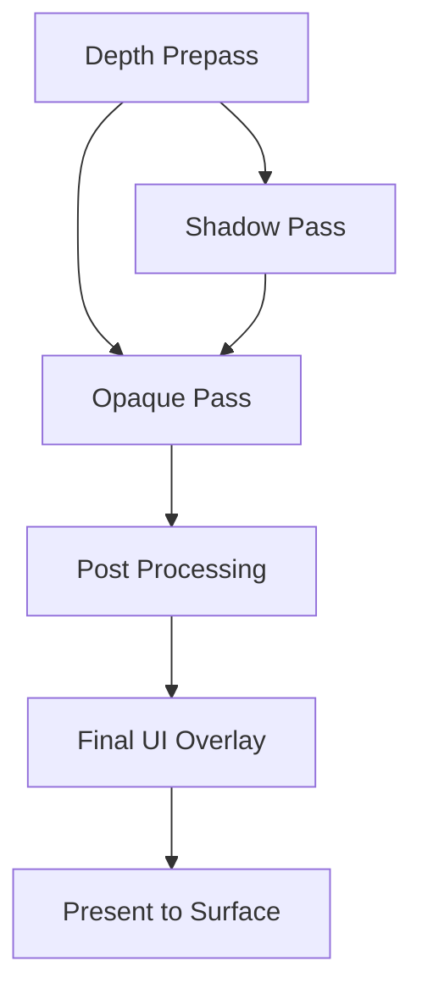
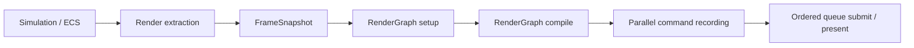

# Architecture Spec: Rendering & RenderGraph

Arisen Engine uses a **RenderGraph** architecture based on a **Directed Acyclic Graph (DAG)** to manage rendering operations. This system decouples the "what" of rendering (passes, dependencies, resources) from the "how" (GPU command submission, synchronization).

---

## 1. Core Packages

The rendering stack is composed of three primary layers:

1.  **`com.arisen.dag`**: The generic library for managing node dependencies and topological sorting.
2.  **`com.arisen.rendering`**: The core package providing the `RenderGraph` infrastructure, the `RenderPipeline` base class, and shared resource management.
3.  **`com.arisen.generic-renderpipeline`**: The baseline implementation package that provides standard passes (Clear, Geometry, etc.) for common rendering tasks.
4.  **`com.arisen.rhi.vulkan.native`**: The native driver that translates the `RenderGraph`'s compiled passes into specialized Vulkan command buffers.

---

## 2. The RenderGraph Pattern

Unlike traditional "Forward" or "Deferred" pipelines that are hard-coded, the Arisen RenderGraph is built dynamically at runtime:

### Nodes as Passes
A `RenderPass` in Arisen is a node in the DAG. Each pass declares:
-   **Inputs**: The textures or buffers it needs to read from.
-   **Outputs**: The textures or buffers it will write to.

### Automatic Optimization
Because the engine knows the entire graph, it can perform several high-end optimizations automatically:
1.  **Resource Aliasing**: If two textures are never used at the same time, they can share the same physical GPU memory.
2.  **Automatic Barriers**: The graph automatically inserts `VkBarrier` or `PipelineBarrier` calls when an output of one node is used as an input for another.
3.  **Culling**: If a pass produces an output that is never consumed by the final display pass, that entire node (and its dependencies) is culled from the execution array.

### RenderPipeline Orchestration
The `RenderPipeline` base class manages the lifecycle of the `RenderGraph`. Instead of manual rendering loops, developers override `SetupGraph()` to register their passes.
```csharp
protected override void SetupGraph(RenderGraph graph, RenderContext context)
{
    ReadOnlySpan<Camera> cameras = context.Cameras;
    graph.AddPass(new MyCustomPass());
}
```

---

## 3. Data-Driven Workflow

Render-pipeline implementations and pass topology are code-defined. A workspace selects one package-owned `RenderPipelineSettings` asset through `manifest.json`; the concrete `IRenderPipelineProvider` loads that asset and creates the corresponding `RenderPipelineAsset`. Serialized settings hold durable quality policy, not an arbitrary executable pass graph.



### Generic Render Pipeline
The `com.arisen.generic-renderpipeline` package provides the current baseline implementation:
- **Composition selection**: the package registers `IRenderPipelineProvider`; it no longer assigns a development default during package load.
- **Serialized quality**: `.arisrenderpipeline` assets index as `RenderPipelineSettings`. Source version 2 preserves compatible version-1 defaults and adds a bounded cascade count, maximum shadow distance, practical split weight, and terminal fade fraction. `MapSize` is selected by the settings asset/quality tier and applies to every cascade layer. Source and cooked loaders reject non-finite or out-of-range values; the current limits are one to four cascades, a power-of-two map size from 256 to 8192, a maximum distance from 5 to 10000 world units, split weight from 0 to 1, and terminal fade from 0 to 0.5.
- **Code-owned graph**: `GenericRenderPipeline.SetupGraph` still defines pass topology and can recompile its reusable graph when that code-defined signature changes.
- **Parallel construction**: the pipeline resolves the global `ITaskGraph` from the kernel to record independent pass work across multiple CPU cores.
- **Optional package features**: `com.arisen.generic-renderpipeline` provides `IGenericRenderPipelineFeatureRegistry` as a setup-only service. A selected adapter package resolves it once during `IPackageEntry.OnLoad`, registers one stable feature instance, caches that interface, and unregisters the same instance during package unload. Exact-instance registration queries let transactional rollback distinguish a pre-commit ID collision from a registration that committed before throwing; rollback never removes another package's feature. Registration does not select a package; workspace/composition dependencies still own inclusion.
- **Activation freeze**: provider activation sorts registered features once by `(Order, FeatureId)`, rejects duplicate IDs, and freezes the resulting array. Registration after activation and removal while active fail with stable diagnostics. Provider deactivation unfreezes the registry only after `RenderSubsystem` has disposed the active pipeline, allowing dependent packages to unregister idempotently during reverse package unload.
- **Bounded callbacks**: each active feature receives extracted-frame consumption and resource-preparation callbacks, then graph contribution at two explicit stages. `DirectionalShadow` runs after the built-in static-mesh cascade pass and before shadow consumers; contributed shadow passes receive the immutable cascade frame data and must load/store the shared depth-array resource while targeting its per-layer views. `Opaque` runs after the built-in opaque pass and before transparent rendering; contributed opaque passes must load/store shared HDR scene color and frame depth. Submission notification carries the final ticket, and device-resource release runs in reverse feature order before backend unload.
- **Hot-path ownership**: feature arrays are immutable for the active pipeline. `SetupGraph` iterates the cached array directly and never queries `IServiceRegistry`; pass recording receives only feature-owned prepared pass state. Feature frame/graph/submission contexts and their spans, graph textures, and environment resources are borrowed for the current callback and must not be retained or disposed by an adapter.
- **First optional feature**: `com.arisen.terrain.generic-renderpipeline` extracts visible terrain components into reusable arrays in deterministic root/Z/X/GUID order. Its residency provider validates cooked roots and acquires shared Generic RP texture-cache leases for every layer's mipped albedo, renormalized normal, and ORM inputs. One compact root-shared descriptor buffer carries at most four layers with tint, material multipliers, world tiling, and bindless image/sampler indices; terrain requests trilinear repeat sampling at 8x anisotropy and the RHI clamps it to device capability. Outside command recording the provider creates independent bindless height, four-channel weight, and geometric-error storage buffers per tile and reference-counts one immutable vertex/index grid plus bounded LOD/stitch pattern ranges per tile resolution. `TerrainOpaquePass` is contributed at the opaque stage with load/store declarations for graph-owned HDR scene color and depth; it records one direct indexed draw per selected fixed patch exclusively through `RenderCommandList`, with ranges of at most 256 draws exposed as deterministic TaskGraph work items. Resource release is submission-ticket deferred, and device teardown invalidates prepared ownership so still-resident keys return to `Waiting` and rebuild through normal frame-boundary setup.
- **Terrain material evaluation**: the opaque terrain shader treats layer count as bounded descriptor data rather than an unbounded keyword variant. It deterministically normalizes four-channel weights with layer-zero fallback, blends decoded tangent normals in slope space, applies albedo tint and ORM roughness/metallic multipliers, and evaluates GGX direct sunlight plus ambient response in HDR. UVs use root-local float coordinates and a phase derived once from double-precision root placement, so camera/origin rebasing does not reset world-space texture placement.
- **Terrain LOD planning**: `ITerrainLodPlanner` is a backend-neutral, setup-owned service. It consumes resident generation-qualified CPU tiles, a double-world camera and render origin, projection parameters, viewport height, and a bounded quality contract. Immutable fixed-patch acceleration provides conservative min/max bounds and localized geometric error. The planner applies screen-space error with hysteresis, origin-relative frustum culling, a maximum one-level neighbor delta, deterministic four-edge stitch masks, and nearest-first overflow selection. Its reusable candidate/output arrays and iterative heap sorts allocate no managed memory in a warmed steady-state call. Render passes consume only the resulting patch span; they must not invoke the planner while recording commands.
- **Terrain observability**: Tracy zones cover extraction, resource preparation, LOD planning, patch expansion, cascade preparation, opaque/shadow recording, root/tile cooking and reading, and prepared-resource release. Coarse plots expose resident/visible tiles, LOD 0-12 histograms, candidate/selected/culled/overflow patches, prepared/rejected/submitted draws, shadow work, seam violations, CPU/prepared bytes, layer descriptors, setup time, budget pressure, and pending disposal. `com.arisen.terrain` owns the read-only `ITerrainDiagnostics` snapshot service and its setup-only publisher contract. During Generic RP frame preparation, the terrain adapter joins bounded cooked root/tile/layer identity, selected patch LOD/stitch/error/bounds, CPU/GPU bytes, immutable residency owners/state, reload dirty/failure state, four-edge neighbor availability and exact shared-height seam checks, and one camera-position terrain query. The completed immutable snapshot is atomically published for Editor readers; Avalonia never walks mutable renderer dictionaries, ECS pools, or GPU state. Runtime world- and terrain-streaming validation requires the one-shot `[Terrain.GenericRP] Submitted terrain draw commands` marker to report a positive count, including copied cooked-only Production output.
- **Terrain replacement**: Asset-change notifications are coalesced and applied only during frame-boundary setup. The adapter prepares replacement root textures and every affected resident tile before atomically publishing matching CPU root/tile generations. A failed replacement leaves the previous queryable and drawable generation intact. Shared texture leases release their exact allocation generation, allowing a superseded image/view/sampler to overlap its replacement until the final old lease and submission ticket retire.
- **Terrain authoring preview**: `ITerrainAuthoringPreviewService` is the package-neutral handoff for immutable unsaved root/tile revisions. Editor brush commands enqueue a self-contained bounded snapshot of every dirty tile; pending revisions coalesce per root and the latest revision survives cell/resource reloads without losing earlier edits. During frame setup, the terrain adapter validates a preview against the resident root, creates every changed tile's replacement buffers first, then atomically publishes the matching CPU/GPU revision while preserving unrelated tile generations. A clean save/reimport revision clears dirty diagnostics, and a prepared-resource reload reapplies the retained authoring preview before attempting a source recook. Recording never reads the authoring document, and superseded buffers remain submission-ticket deferred. Invalid or incomplete previews retain the previous drawable generation.
- **Vegetation feature boundary**: `com.arisen.vegetation` owns backend-neutral species/biome/cluster contracts, the package-owned scene codec, immutable generation-qualified CPU runtime data, bounded queries, diagnostics, and authoring-preview publication. `com.arisen.vegetation.generic-renderpipeline` is an optional Generic RP adapter selected by composition; it registers the feature and a residency prepared-resource provider that decodes exact residency-held handles on workers. Cluster/page claims bind and validate the reciprocal biome/species/page/parent closure, while species and biome claims bind mesh/material and species dependencies. Publication revalidates the complete owner-plan generation at the frame boundary. It intentionally adds no GPU instance-buffer or RenderGraph pass yet; that is Immediate Sprint item 5. `com.arisen.vegetation.editor` is an Editor-only extension that consumes the package-neutral diagnostics/preview services and owns future authoring UI. Neither adapter exposes Vulkan types or performs service lookup, allocation, or asset discovery during command recording.

---

## 4. Multi-Threading (TaskGraph)

Rendering execution is integrated with the `com.arisen.taskgraph` job system. 
-   **Command Recording**: Multiple render passes can record their native command buffers in parallel across different CPU cores.
-   **Submission**: The `RenderSubsystem` collects these buffers and submits them to the GPU queue in the correct topological order.

Current implementation:
- `RenderPipeline` owns a reusable `RenderGraph`.
- `RenderGraph` compiles pass dependencies into parallel layers.
- `RenderGraph` caches the compiled topology as pass-node ids and parallel-layer ids when the graph signature is stable, so steady-state frames can skip the DAG compiler while still resolving the current frame's pass instances.
- The generic DAG compiler reports dependency cycles with remaining node/edge context, and RenderGraph wraps compile failures with render pass graph state.
- RenderGraph validates that declared resources belong to the current frame graph, so stale transient resource handles fail during setup instead of during command recording.
- Each pass records through a `RenderCommandList`, which is the CPU-side facade over the current RHI command buffer.
- Worker threads use per-thread/per-surface command pools so command recording can happen concurrently.
- `TaskGraphPackage` owns the single shared worker pool. RenderGraph uses the one-shot `AddTask`/`Execute` mode because recording work is rebuilt from each frame, while ECS uses `ITaskSchedule` to compile stable system topology once and execute it repeatedly with updated world/time context.
- Task dispatch uses value-type queue records and a reusable completion batch instead of allocating an `ActionTask` wrapper and `CountdownEvent` per submitted task. Worker failures are returned to the waiting engine thread after the current layer completes.
- Small passes record as one pass-level work item; heavy passes may expose multiple `RenderPassWorkItem` ranges.
- `StaticMeshPass` is currently the first range-capable material/mesh pass. It prepares material pipeline batches from shader GUID, shader dependency stamp, material render state, and color/depth formats, then splits a pass-owned prepared draw-command array so command recording binds one compatible pipeline per batch.
- Static-mesh material replacement uses a semantic pipeline signature containing shader GUID, shader dependency stamp, cooked shader-variant identity, render state, and resolved render queue. Equivalent prepared shader objects and texture/scalar/vector constant changes update draw data without incrementing the pipeline-batch version; only a signature change rebuilds compatible PSO batches. Native `RHIPipelineState` cache identity is a separate process-unique 64-bit value used to prevent allocator-address reuse from aliasing Vulkan cache entries.
- A successful `GetGraphicsPipeline`/`GetComputePipeline`/`GetRayTracingPipeline` call transfers one explicit pipeline-handle ownership obligation to its caller. The creating pass or batch retains the exact `RHIPipelineCache` and calls `ReleasePipeline` before releasing the corresponding `RHIPipelineState`; format changes, shader replacement, setup failure, device-resource release, and final disposal follow the same order.
- Vulkan PSO cache maps are non-owning lookup tables. Binding a pipeline retains its generation-checked resource-registry record in the native command buffer, queue submission stamps that record with the queue ticket and releases the command-buffer reference, and releasing the public pipeline handle removes its cache/pool entry plus owner reference. `VkPipeline` and `VkPipelineLayout` destruction therefore occurs only after every stamped submission ticket completes, while never-submitted pipelines can retire immediately.
- The managed `IRHIDevice.GetCompletedSubmitTicket` boundary is an active completion poll, not a read of indefinitely cached state. `RHIDevice_GetCompletedSubmitTicket` obtains the graphics queue, calls `RHIQueue.Update()`, and then returns `GetCompletedTicket()`. Frame-boundary deferred-disposal services rely on this poll to retire terrain buffers, shared textures/grids, pipelines, and other ticket-stamped resources even when no caller uses the lower-level queue bridge directly.
- Vertex-buffer bindings are draw-local at execution. A pass may queue multiple vertex bindings for one draw, but the Vulkan executor clears that pending binding list after every direct or indirect draw so later meshes cannot inherit an earlier binding-zero buffer.
- GPU submission remains ordered by the compiled graph's topological order.
- A shared graphics device has one global frame-resource sequence across every render surface. `RenderFrameSnapshot.FrameIndex` is the surface-local output index used only for that surface's swapchain image, producer/consumer semaphores, presentation, and output diagnostics. `RenderFrameSnapshot.FrameResourceIndex` is the device-global slot used by command buffers, per-frame descriptor state, and mapped constant/upload rings. A render surface must never select device resources by applying modulo arithmetic to its output index.
- `RenderSubsystem` reserves each device frame-resource slot before frame setup and records the final graphics submission ticket when the reservation completes. Before reusing that slot, it waits for that exact prior ticket and verifies completion. This is an ownership boundary, not pacing: correctness does not depend on elapsed time, extra frames, viewport order, or a blanket device-idle wait. Graphics-generation replacement resets the slot sequence only after old device resources have been quiesced.
- `EditorEngineRunner` retains ownership of its foreground engine thread until the frame loop and `EngineKernel.Shutdown()` have returned. Stop requests cancellation, waits on the thread-owned completion signal, confirms actual termination with an untimed join, and only then disposes cancellation state and releases thread ownership. Frame-loop and shutdown failures fault that completion signal; Avalonia observes the failure, initiates application shutdown, and returns a nonzero exit code. A completed or faulted thread cannot be restarted until `Stop` observes its result and releases the prior run.
- Profiles with `EnableProfiler: true` emit Tracy profiler zones for frame ticks, RenderGraph compile/record/submit work, TaskGraph layers, and worker-thread tasks.
- RenderGraph plots `RenderGraph.CompileCacheHit` so Tracy can show whether a frame reused the compiled topology.
- Ordinary warmed rendering emits profiler plots/zones but no frame text. Verbose render text is a process-start diagnostic policy selected with `ARISEN_RENDER_DIAGNOSTICS`; accepted comma-separated categories are `frame`, `submission`, `graph`, `passes`, and `all`. An absent or empty value selects no verbose categories, and an unknown category fails RenderSubsystem initialization with an attributable configuration error.
- `frame` owns RenderSubsystem snapshots, shared-texture pacing, and output-publication details; `submission` owns per-surface acquire/end summaries; `passes` owns Generic RP setup and command-recording details. These categories are intentionally verbose when selected, and their disabled warmed check is one allocation-free bit test performed before interpolated diagnostic strings are created.
- `graph` logs compiled pass order, compiled layers, resource access chains, pass-culling status, work-item counts, transitions, transient lifetimes, and submit totals only for the first graph or a changed compiled topology. It does not use a frame interval to repeatedly emit unchanged topology.
- Failure, validation, and lifecycle reporting is independent of verbose categories. Failed submission/presentation/retirement, stale ownership, Vulkan validation messages, and setup/teardown transitions remain attributable when `ARISEN_RENDER_DIAGNOSTICS` is unset. First-party Vulkan render code must use the owned logger/error channel and must not write directly through `printf`, `std::cout`, or `std::cerr`.
- Visual scene diagnostics are setup/extraction-owned. `RenderSubsystem` plots snapshot counts for cameras, static mesh items, directional lights, point lights, spot lights, scene environments, and output size. `GenericRenderPipeline` plots registered/prepared material counts, accepted light/environment counts, visible draw commands after culling, scene-color dimensions/format, cascaded-shadow enabled/size/count state, effective environment exposure, sky mode, and atmosphere/aerial/height-fog enablement. `StaticMeshPass` plots draw, material batch, queue class, work-item, point-light, spot-light, and object-buffer counts, while `DirectionalShadowPass` plots total and dropped shadow draws, cascade count, map size, fitted dimensions, texel scale, and enabled state. The terrain adapter reports its own per-cascade submitted/dropped work. Throttled setup logs include mesh, material, light, environment, culling, and visible draw summaries.

Target production flow:



Threading rules:
- Simulation must not be read directly by render worker threads. Rendering consumes a stable frame snapshot.
- `SceneSubsystem` owns one `EntityManager` for its initialized lifetime. Persistent and additive scene instances contribute generation-checked entities to that same world; scene switching and cell unload never swap the manager out from under systems or extraction.
- Runtime scene activation and unload are structural operations processed at `EngineKernel.OnFrameEnd`. A validated scene becomes visible to ECS systems and render extraction on the following frame. Unload removes only the instance-owned entities before the following extraction, with stable dense-pool compaction preserving surviving order.
- Render/ECS inner loops use the dense `Entity` values stored beside component arrays. The handle's generation participates in sparse membership checks, but authoring GUID maps and scene-instance ownership dictionaries remain setup/tooling data and are never queried per draw, light, or entity iteration.
- `RenderSubsystem` extracts camera data, static mesh render items, any legacy prepared draw list, output target, surface, frame index, and timing data into `RenderFrameSnapshot` before RenderGraph setup/execution begins.
- Snapshot arrays are copied into `FrameArena` and exposed as `ReadOnlySpan<T>` from pointer/count pairs so command-recording tasks can capture the context without holding managed ECS buffers.
- Pass setup may resolve cached resources, but pass recording must not perform service-registry lookups, shader compilation, asset discovery, or unbounded allocation.
- The current smoke ShaderLab shader, smoke checker texture, and smoke mesh are referenced by stable asset GUIDs; ShaderLab parsing, shader cooking/loading, and GPU upload happen during pipeline/resource setup, not inside command recording. ShaderLab compile-time keyword declarations are validation metadata until a material explicitly selects `Shader.Keywords`; selected keywords are encoded into cooked shader variant names and pipeline variant identity. Runtime specialization constants are reserved for small non-layout constants and should not replace explicit cooked variants when shader interface or render-state compatibility changes.
- `RHITexture2DResource` is the first setup-time texture upload owner. It consumes cooked Texture2D bytes, creates an upload buffer, records a one-shot copy command buffer, transitions the image to shader-read layout, creates an image view and the binding-resolved sampler, and registers both the image view and sampler in the global bindless table. Binding-local min/mag filter, mip mode, and per-axis wrap settings are mapped to shared RHI enums during setup. It unregisters those bindless indices before releasing the sampler/image-view/image handles.
- `MaterialAssetCooker` converts authored material source into a cooked `material.runtime` payload. Shader source may declare required Texture2D/scalar/Vector4 bindings with lightweight `@arisen.material.*` annotations or a ShaderLab `MaterialContract` block; authored material source may also use the preferred `Shader.Contract` block on the shader reference, with material-level `ShaderContract` still accepted as a compatibility/extension path. Validation happens during source/cook/setup loading before GPU resource preparation. Version 6 carries optional sampler settings and UV transform metadata per Texture2D binding; omitted values resolve deterministically. `RHIMaterialResource` consumes the cooked material model during setup, resolves Texture2D refs, uploads texture resources, and caches bindless image/sampler constants, texture transforms, typed scalar/Vector4 material property values, and authored or ShaderLab-derived render-state intent. BuildTool-generated material refs expose package-owned typed asset refs plus texture slot/property names for setup code. The standard material names include `BaseColor`, `Normal`, optional `Emissive`, packed `MetallicRoughness`, optional `Occlusion`, `MetallicFactor`, `RoughnessFactor`, `OcclusionStrength`, `AlphaCutoff`, `BaseColorFactor`, and `EmissiveFactor`; packed channels are `R=occlusion`, `G=roughness`, and `B=metallic`. RenderGraph pass recording only consumes already-prepared unmanaged draw and object constants.
- `GenericRP/StandardLit` is the first production-facing ShaderLab material contract and is now the generic render pipeline's default material. It requires base-color and normal textures, metallic/roughness scalars, a base-color factor, and an emissive factor; it also supports optional `Emissive`, packed `MetallicRoughness`, and `Occlusion` Texture2D slots plus deterministic occlusion-strength and alpha-cutoff defaults. It declares explicit `USE_NORMAL_MAP`, `ALPHA_TEST`, and `USE_TRIPLANAR` compile-time keyword variants. The default path samples tangent-space normals from cooked static mesh tangents, while the triplanar path projects base color from world position for meshes whose authored UV islands would visibly repeat a surface texture. Packed metallic-roughness multiplies the authored roughness from green and metallic from blue; occlusion reads red, applies authored strength, and attenuates only ambient/indirect diffuse and specular. Direct lighting and emissive remain unoccluded. The `ALPHA_TEST` variant clips sampled base-color alpha against the authored `AlphaCutoff` before fragment color/depth output. The package-owned `StandardLitMaterial` and flat `DefaultNormal` texture are generated as typed asset refs. `StaticMeshPass` resolves all material properties and optional texture bindings during setup, then stores emissive/PBR factors, presence flags, and bindless indices in each draw's storage-buffer object record instead of widening the already packed push constants. It also appends three aligned environment-lighting records containing prepared irradiance, prefiltered-specular, and BRDF-LUT indices plus rotation, intensity, max LOD, and an enabled flag; the draw push-constant contract remains 124 bytes. Command recording stays allocation-free and source-asset-free. The direct-light model is Cook-Torrance with GGX distribution, Smith visibility, and Schlick Fresnel; directional, point, and spot lights share that BRDF. When IBL is valid, StandardLit samples lat-long irradiance by world normal, samples the prefiltered reflection at `roughness * maxLod`, applies the split-sum BRDF LUT and roughness-aware Schlick energy weighting, and scales indirect light by authored environment and scene ambient intensities. Missing IBL retains the deterministic colored-ambient formula. Direct lights and material emission remain in linear HDR scene color.
- `DirectionalLightComponent` is the first scene-authored light source. `.arisenscene` assets may contain `DirectionalLight` blocks with direction-to-light, color, intensity, ambient intensity, and enabled data. The current StandardLit path has an explicit one-directional-light-per-surface/frame limit: `DirectionalLightSnapshotExtractor` scans the contiguous ECS pool without allocation, accepts the first enabled light into `FrameArena`, and reports source, enabled, accepted, and dropped counts. `RenderSubsystem` exposes the accepted snapshot, plots the counts in Tracy, and emits a throttled overflow warning. `GenericRenderPipeline` uses that accepted light or a deterministic default; `StaticMeshPass` turns it into compact unmanaged constants during setup, and `StandardLit` consumes those constants for direct plus ambient lighting.
- `PointLightComponent` and `SpotLightComponent` are the first local light sources. Point-light position comes from `TransformComponent`; spot-light position and cone axis come from `TransformComponent.Position` and local `+Z` rotation. Authored local-light data stores RGB color, intensity, range, and enabled state; spot lights additionally store inner/outer cone angles. `PointLightSnapshotExtractor` and `SpotLightSnapshotExtractor` scan contiguous component pools plus matching entity spans, resolve transforms from the transform pool, accept up to four enabled lights of each type per frame, and report source, enabled, accepted, missing-transform, and dropped counts. `StaticMeshPass` appends point-light records after per-object records and spot-light records after point lights in the existing bindless object-data upload buffer. Point and spot counts are packed into the existing local-light count push-constant field, avoiding widened push constants or a new descriptor binding. `StandardLit` reads those records in the fragment stage, applies range/cone attenuation, and evaluates the same GGX direct-light function used by the directional light. Environment image-based lighting is evaluated separately as indirect light and does not change local-light records or loops.
- `SceneEnvironmentComponent` is the scene-authored environment source. `.arisenscene` `Environment` blocks provide an optional `EnvironmentTexture` GUID/package reference plus sky, horizon, ground, and ambient colors with independent sky/ambient intensity. `SceneEnvironmentSnapshotExtractor` scans the contiguous component pool without allocation, accepts one enabled environment per surface/frame, and copies the GUID and numeric data into `RenderFrameSnapshot`; no managed ECS storage is exposed to render workers. Scene inspection resolves the optional ref as `EnvironmentTexture` and reports missing/wrong-type references without turning source parsing into render work.
- `EnvironmentTextureAssetLoader` parses `.arienvironment` metadata during setup. Source version 2 adds an optional bounded `Outdoor` profile containing visible-sky mode, sun/sky coupling and disc/glow response, horizon/zenith exponents, aerial start/distance/strength, exponential height-fog parameters, and `Scene` or `Fixed` exposure policy. Every scalar is finite and range-checked before publication. Source version 1 remains compatible as panorama sky with atmosphere disabled and scene exposure.
- `EnvironmentTextureAssetCooker` converts strict 2:1 lat-long PPM/PNG/JPEG or float HDR input into a linear `R16G16B16A16_SFLOAT` cooked payload. Cooked format 2 stores the outdoor profile in a fixed 144-byte little-endian header; the reader still accepts the legacy 64-byte format-1 header and applies disabled-profile defaults, while source-enabled cooking treats format 1 as stale regardless of timestamp. Pixel access uses the validated format-specific payload offset. `RHIEnvironmentTextureResource` uploads the panorama once through the common synchronous 2D allocation owner, uses repeat-U/clamp-V sampling, registers bindless image/sampler indices, and exposes the immutable cooked outdoor profile. Combined descriptor/source dependency stamps drive deferred-safe hot replacement.
- `EnvironmentLightingAssetCooker` derives setup-ready IBL data from the cooked linear panorama and caches it as `ibl.latlong.rgba16f.v1`: a 32x16 cosine-convolved diffuse-radiance map, a 128x64 GGX-prefiltered specular map with eight roughness mips, and a 128x128 split-sum BRDF integration LUT. `RHIEnvironmentLightingResource` uploads and owns those three half-float textures, exposes their bindless image/sampler indices plus specular max LOD, and follows the same dependency-stamp and deferred-disposal policy as the visible panorama. The common uploader accepts tightly packed mip chains, records one copy region per mip, uses a full-chain sampler LOD range, and transitions all mips before shader access. Generation and upload run only during pipeline setup; pass recording receives prepared data only.
- `EnvironmentFrameBuffer` uploads one shared 16-`float4` environment record into a ring sized from `RHIInstance.MaxFramesInFlight`. It carries camera basis/projection data, accepted directional-light data, panorama bindings, the outdoor profile, graph-depth binding/convention, and effective exposure. `EnvironmentSkyPass` and `OutdoorAtmospherePass` receive only its prepared bindless buffer index through compact push constants; neither pass creates resources while recording.
- `EnvironmentSkyPass` uses a vertex-buffer-free fullscreen triangle. `Panorama` mode reconstructs world direction from the primary camera basis/FOV/aspect, maps it to lat-long UV with authored rotation, and samples the bindless linear half-float panorama into HDR scene color. `ProceduralOutdoor` mode instead evaluates scene-authored ground/horizon/sky colors with bounded horizon/zenith response and adds a sun disc/glow from the same accepted directional-light direction, color, and intensity used by lit geometry. Visible-sky selection does not alter environment-lighting ownership: the panorama continues to feed irradiance, prefiltered specular, and BRDF-LUT IBL in either mode. Missing/failed environment data retains the deterministic no-sun procedural fallback.
- `RenderGraphTexture` owns reusable transient texture allocations requested by a pipeline. `GenericRenderPipeline` requests `SceneColor` as a `FORMAT_R16G16B16A16_SFLOAT` color-attachment/sampled image, `FrameDepth` as a depth-only `FORMAT_D32_SFLOAT` attachment, and `DirectionalShadowMap` as a settings-sized `FORMAT_D32_SFLOAT` depth-attachment/sampled 2D array with one layer per cascade. An array allocation has one aggregate 2D-array view, one backend-neutral 2D view and bindless sampled-image index per layer, and one shared sampler. The graph owns those allocations, deferred-safe replacement through the render-resource disposal queue, and current resource state across frames. Array layer ranges stay in shared image/view descriptors and Vulkan lowers them without exposing Vulkan types to RenderGraph passes. Frame depth gains sampled usage and a bindless image entry only when the active outdoor profile enables atmosphere; the atmosphere shader uses integer texel loads and requires no depth sampler.
- `OutdoorAtmospherePass` is optional and runs after transparent rendering but before tonemapping. Its graph declaration reads `FrameDepth` as a shader resource and load/stores graph-owned HDR `SceneColor`; the fragment shader never samples scene color, so blending introduces no attachment feedback loop. It detects clear depth under an explicit forward/reversed zero-to-one convention, reconstructs linear perspective or orthographic distance, evaluates bounded aerial perspective plus exponential height fog in camera/origin-relative space, and outputs haze color/opacity through standard alpha blending. Shader/pipeline creation and the environment/depth constants are setup-owned, while recording only begins the existing HDR attachment, binds prepared state, and draws one fullscreen triangle. Projection and Y behavior contain no backend macro or Vulkan branch.
- `TonemapPass` is the first explicit output pass. It samples the HDR scene color through prepared bindless indices, applies the environment profile's resolved effective exposure plus an ACES-style filmic curve, then writes the current swapchain or editor shared output. `Scene` policy uses the scene-authored linear multiplier carried through `SceneEnvironmentComponent`; `Fixed` policy uses the environment asset value. Both are normalized to `[0, 64]`, omission preserves the `1.0` baseline, and non-finite scene exposure resolves to `1.0`. Automatic exposure is intentionally deferred. Because scene color is written through the RHI top-left viewport contract and then read back as a texture, the pass flips the sampled V coordinate once when mapping fullscreen output pixels back to scene-color texels. It is now the only generic pipeline pass that performs explicit sRGB encoding for eight-bit UNORM outputs such as the editor's shared `R8G8B8A8_UNORM` image; native sRGB swapchains use fixed-function encoding, and floating-point outputs stay linear.
- `DirectionalShadowPass` renders the accepted directional light's static-mesh cascades into the graph-owned depth array before lit consumers. It receives only per-layer image views, format/dimensions, immutable cascade constants, and compact setup-owned draw ranges. Recording loops the active layers, clears/stores each layer through `RenderCommandList.BeginRenderingDepthOnly`, and replays only that cascade's range. The package-owned `DirectionalShadow.hlsl` vertex/fragment shader preserves alpha-tested caster clipping; transparent materials never enter the caster span. Depth-write and later shader-read declarations drive one graph-planned array-resource transition, so neither the built-in pass nor feature passes issue manual image transitions. Constant-plus-slope raster depth bias remains in the shared `RHIPipelineState` contract.
- Static mesh queue policy is explicit and setup-owned. `RenderQueuePolicy` resolves opaque materials to queue `2000`, alpha-test materials to queue `2450` when the cooked shader keyword set contains `ALPHA_TEST`, and blend-enabled materials to queue `3000`. `GenericRenderPipeline` partitions camera-visible commands into reusable depth-writing and transparent spans before pass preparation. The opaque/alpha-test pass sorts by queue, pipeline batch, material id, mesh buffers, submesh offset, and original draw index for deterministic pipeline-friendly submission. `TransparentDrawOrdering` instead sorts transparent commands by descending camera-space depth from the transformed local origin and preserves source order for equal-depth ties. A dedicated transparent `StaticMeshPass` keeps that prepared order, runs after opaque HDR lighting, loads and tests the opaque depth attachment with `COMPARE_OP_LESS_OR_EQUAL`, disables depth writes, and uses each material's prepared blend state. RenderGraph work-item command buffers remain parallel-recorded but are submitted in sorted index order. Transparent materials are excluded from the depth-only directional shadow caster span; alpha-test materials remain depth-writing and shadow eligible.
- Static mesh culling and cascade preparation are setup-owned. `DirectionalShadowFitter` clamps coverage to the lesser of camera far clip and the authored maximum distance, partitions linear camera depth with a practical logarithmic/linear split, and fits each camera-frustum receiver slice in a camera-relative light basis. Each slice uses a quantized bounding radius, padded depth range, light-space center snapped to map texels, and a bounded transition interval. `StaticMeshFrustumCuller` tests conservative world AABBs against each fitted light frustum; items without usable bounds remain conservatively visible. The resulting submesh draws occupy deterministic flat per-cascade ranges capped at 65536 total commands, with explicit dropped-work diagnostics. Command recording performs no scene queries, service lookup, culling, or managed allocation. Tracy exposes source/visible/culled counts, cascade count, draw pressure, fitted diameter/depth, and world units per texel.
- `DirectionalShadowFrameData` uploads four matrices, split/transition distances, per-layer bindless indices, PCF/bias/strength settings, and terminal-fade distances once during setup into a frame-ring storage buffer. `StandardLit` and the terrain shader select a cascade by linear camera depth, blend with the next layer through the transition interval, and fade the terminal cascade to unshadowed lighting. Both reconstruct camera-relative positions and share the same projection/Y convention, so origin rebasing and backend projection details do not branch in material shaders. `com.arisen.terrain.generic-renderpipeline` culls prepared patch bounds per cascade into its own bounded flat ranges and contributes a load/store terrain depth pass against the same layer views before opaque terrain shading.
- Visual diagnostics are not part of the draw-recording contract. New counters should be emitted during extraction, setup, pass preparation, or once per pass work item, not per entity or per draw unless the pass is already iterating that data for required command emission.
- `IRenderMaterialLibrary` is the first material registry contract. Scene/bootstrap code registers materials by stable GUID or `AssetRef<MaterialSourceAsset>` and receives compact material ids; the generic render pipeline provider prepares those GUID-backed materials into `RHIMaterialResource` instances during setup and feeds `StaticMeshPass` a material-slot snapshot.
- `IRenderPipelineProvider` is the composition-facing pipeline contract. The root package depends on the concrete provider package and requires the service; `RenderSubsystem` consumes the single selected provider once during initialization and asks it to activate the settings GUID/package identity from the manifest. The reference package owns the asset and can be the game package; provider selection comes from composition. Generic RP owns its loader and schema validation, while shared rendering owns no Generic RP implementation dependency. During shutdown or graphics-generation replacement, `RenderSubsystem` first disposes the active pipeline and invokes the provider's idempotent device-resource release hook before the selected RHI backend can destroy its device. After a successful backend replacement, it resolves the stable `IRHIDevice` service's new native attachment and reactivates the selected pipeline asset. This ordering is backend-neutral and applies equally to Vulkan, DX12, and Metal providers.
- Scene ownership is shared across product boot and editor tooling through the stable world consumed by `SceneSubsystem`. With `StartupWorld`, `ProjectSceneBootstrapSubsystem` asks `IRuntimeWorldStreamingService` to validate and stage the descriptor during `PostInit` and acquire persistent-scene residency. Ready residency may publish immediately; otherwise the service defers until a later frame boundary and then publishes the world and persistent scene atomically. Without `StartupWorld`, the `StartupScene` compatibility path loads synchronously through `IRuntimeSceneService` during `PostInit`. Only a successful source-v2 or cooked-v2 persistent activation replaces the `SceneSubsystem` world, before additive cells can activate. `IEditorSceneDocumentService` owns the editor's saved and working `.arisenscene` source for that same GUID/package identity. Inspector commands target persistent authoring entity GUIDs, stage immutable source revisions, and queue `SceneSourceSnapshot` previews through the coalesced runtime boundary drained by `ResourcesPackage` at `EngineKernel.OnFrameEnd`; they never mutate live ECS from Avalonia's thread and do not persist until explicit Save. Failed snapshots preserve the prior runtime world, while dirty switching and shutdown require Save/Discard/Cancel resolution. Source and cooked staging canonicalize by authoring GUID, build a compact setup-time GUID-to-dense-entity map, and resolve local hierarchy only after all entities exist. Production consumes the cooked payload and does not parse source YAML; render extraction continues to use contiguous ECS components and never performs authoring-GUID lookup. Camera extraction currently retains every finite camera in ECS pool order and Generic RP consumes the first camera as its primary view; there is not yet an enabled/role/priority camera-selection contract. Because the persistent scene activates before additive cells, canonical streamed content owns one gameplay camera under `Persistent` and keeps cell payloads free of competing `Main Camera` fixtures until an explicit camera selector is implemented.
- The first real mesh source was `TexturedQuad.obj`; the generic pipeline retains `FacetedCrystal.obj` as its package-owned visual fallback. The default application scene now lives at the correct composition boundary in `com.arisen.packagegame`: `LanternShowcaseScene.arisenscene` frames generated children from the package-owned Khronos Lantern GLB model root, while the older Utah teapot/pedestal/ground scene remains secondary diagnostic content. Cooked mesh version 2 stores bounds and submesh metadata in addition to the vertex/index payload. Cooked mesh version 3 adds normals, and the first glTF static mesh importer scope now supports `.gltf` JSON triangle meshes with external or data-URI buffers plus `.glb` binary containers with embedded BIN chunks, POSITION plus optional NORMAL/TANGENT/TEXCOORD_0/COLOR_0, unsigned indices, synthesized non-indexed triangle streams, selected-scene node traversal, matrix/TRS node transforms baked into cooked static vertices, material-slot extraction from primitive material indices, and external buffer write-time recooking for JSON `.gltf` dependencies. Raw `.gltf` / `.glb` files remain mesh assets in this path; production model roots use the separate `ModelSourceAsset` identity, and `GltfModelImportEmitter` can generate package-owned scene, single-mesh source, material, and texture children with stable GUIDs. Generated scenes map each glTF primitive to one mesh-renderer submesh range with that primitive's generated material GUID, while generated mesh sources strip scene/node transforms to avoid double-applying placement. Generated materials use sRGB base-color/emissive variants and linear normal/metallic-roughness/occlusion variants, preserve binding-local glTF sampler and `KHR_texture_transform` metadata, deduplicate shared physical image children, select the explicit `USE_NORMAL_MAP` cooked variant when a normal binding is emitted, map `alphaMode: MASK` to the explicit `ALPHA_TEST` material keyword plus cutoff, and map `alphaMode: BLEND` to straight-alpha blend state consumed by the transparent queue. Nonzero imported UV sets remain diagnostic-only until the mesh/shader path supports them. `RHIStaticMeshResource` creates setup-time upload staging buffers, copies into GPU-only vertex/index buffers, records a transfer-to-vertex-input buffer barrier, releases staging resources before frame recording, and exposes bounds/submesh spans to scene setup code. `RHIStaticMeshResource.CreateDrawCommands` can expand a prepared mesh into one `MeshDrawCommand` per selected submesh using caller-owned spans, with material ids offset by cooked material slots; `CreateDrawCommandsWithMaterialOverride` expands the same ranges while preserving the caller's exact material id for generated per-primitive scene bindings. `MeshRendererComponent` is asset-facing ECS data: mesh GUID, optional material GUID, submesh range, bounds, and visibility. Authored `.arisenscene` assets now provide the first source-driven scene loading path: package setup loads a generated `AssetRef<SceneSourceAsset>`, validates mesh/material refs through `IAssetDatabase`, and spawns ECS camera/transform/mesh-renderer components before render extraction. `MeshSystem` extracts those components plus transforms into `StaticMeshRenderItem` snapshots. `GenericRenderPipeline` resolves those items during setup through its material library and GUID-keyed `RHIStaticMeshResource` cache, then expands them into pass-owned `MeshDrawCommand` arrays; items with explicit material GUIDs use exact material overrides, while mesh-only items may still use cooked material-slot offsets. `MeshDrawCommand` carries prepared RHI buffers plus `FirstIndex`, `IndexCount`, `VertexOffset`, `MaterialID`, and `LocalToWorld`, so draw recording can submit submesh-aware indexed draws without source-path lookup. `StaticMeshPass` declares the vertex input layout, builds graphics pipelines from prepared material render state and pass depth-write policy, prepares per-draw object records into a bindless storage-buffer ring sized from `RHIInstance.MaxFramesInFlight`, unregisters each object-buffer bindless index before releasing its slot, binds the device-local buffers, pushes compact material/object indices, and records indexed draws from its prepared array; when no scene items or legacy draw list exist, the opaque pass draws the fallback package asset's first submesh.
- Static mesh rendering uses one graph-owned `FrameDepth` transient shared by the opaque/alpha-test and transparent passes. `GenericRenderPipeline` binds the prepared image view and format into both passes; `StaticMeshPass` no longer allocates, resizes, releases, or manually transitions a depth image. The opaque pass declares `ClearThenLoad/Store` read/write depth attachment use because its first work item clears and writes while later work items load/test/write. If no eligible draw or fallback exists, it retains one clear-only work item so a later transparent pass cannot load uninitialized depth. The transparent pass declares `ReadOnlyLoad/Store`, loads the opaque result with `COMPARE_OP_LESS_OR_EQUAL`, uses `IMAGE_LAYOUT_DEPTH_STENCIL_READ_ONLY_OPTIMAL`, and disables depth writes. RenderGraph records the undefined/previous-frame-to-write barrier and the write-to-read-only barrier. Pipeline keys retain depth-write policy and depth format.
- Shader, material, texture, environment texture/lighting, and mesh resources cache setup-time dependency stamps from asset source/meta files. `GenericRenderPipeline` subscribes to `IAssetDatabase.AssetChanged`, coalesces changed GUIDs in `RenderResourceReloadQueue`, and drains that queue during `SetupGraph` before pass preparation. Material, shader, texture, environment descriptor/source, and fallback mesh GUID changes detach prepared GPU resources so replacements are created before command recording. Detached resources go through `DeferredRenderResourceDisposalQueue`, which releases only resources whose submitted ticket is already completed during normal frame submission, so bindless descriptor indices and GPU handles are not reused while in-flight command buffers may still reference them. Each queue is explicitly bound to one `(native device handle, backend generation)`, and every pending entry carries that generation. Teardown invalidates residency while the old generation still exists, releases current resources, verifies that the highest pending ticket does not exceed that generation's known last submitted ticket, waits once through that valid boundary, empties the queue, and explicitly unbinds it before backend destruction. A queue cannot silently rebind to a replacement device while old-generation entries remain. Dependency stamp polling remains as a safety fallback, and `StaticMeshPass` keys pipeline reuse on the shader dependency stamp as well as render-target format.
- World streaming couples that safety to cell lifetime through `IRuntimeAssetResidencyService`. GenericRP's `GenericPreparedAssetProvider` owns stable-key mesh, material, and environment/IBL caches and performs bounded setup at the frame boundary outside pass recording. A cell cannot activate until required prepared resources report ready. Final owner release evicts through `DeferredRenderResourceDisposalQueue`; `SharedRHITexture2DResourceCache` additionally deduplicates equal texture-variant/sampler allocations across materials, and its final lease is released only when deferred material destruction is ticket-safe.
- Large-world rendering consumes origin-relative float data. `IWorldOriginService` shifts the active contiguous transform pool only at the frame boundary; camera extraction, `MeshSystem`, point/spot-light extraction, bounds/culling, transparent depth ordering, directional-shadow fitting, and GPU object/light records all see the same origin for the following frame. `RenderFrameSnapshot` carries that frame's double `RenderOrigin` once for diagnostics/future reconstruction, while hot per-object records remain float-only. Non-finite camera, transform, and light inputs are rejected before matrix construction or upload. Origin handling contains no backend projection or Y-axis policy.
- `RenderCommandList` is the pass-facing command API. Passes should not directly depend on concrete native/Vulkan command buffer details.
- Large scene passes should split draw ranges into multiple record tasks instead of treating one RenderGraph pass as one CPU job.
- A pass may return zero work items only when it has no command or attachment operation for the frame; dependency ordering still comes from the compiled graph, and submission skips that pass. A required clear/store operation is command work even when there are no draws.
- Resource access diagnostics are derived from typed `RenderGraphBuilder` declarations, imported `FrameColor`, graph-owned transient textures such as `SceneColor`, `FrameDepth`, and `DirectionalShadowMap`, virtual ordering resources, and frame-boundary passes. The planner turns those declarations into shared resource states such as color attachment, read/write depth attachment, read-only depth attachment, shader read, transfer read/write, and output ownership; it logs planned transitions and validates invalid chains before command recording. RenderGraph records planned `FrameColor` acquire/release barriers before the boundary passes through shared `RHIImageMemoryBarrier`/`PipelineBarrier` APIs, while backend-specific layout and queue-family encoding stays inside concrete RHI packages. `OutputOwnership` is output-kind aware: the first use of a newly created target begins at `UNDEFINED`; an initialized native swapchain image begins and ends at `PRESENT_SRC_KHR`; an initialized Editor shared image begins and ends at externally owned `TRANSFER_SRC_OPTIMAL`; and an offscreen output remains transfer-readable in `TRANSFER_SRC_OPTIMAL`. The Vulkan swapchain validates the tracked native image layout immediately before presentation or shared-texture publication. It never changes layout bookkeeping merely to make presentation pass; a tracked layout changes only with a recorded graph/native barrier whose queue submission was accepted. For graph-owned transient textures, RenderGraph records first-use and cross-state barriers before work item zero of the owning pass, including the shadow depth array's depth-write-to-shader-read chain. Pass work-item counts are preflighted before transition planning, so a zero-work pass contributes neither a barrier nor a persisted state change.
- Bounded standalone visual validation is opt-in through scene or world-streaming smoke's `--visual-summary` flag. The kernel registers one `IRuntimeVisualSummaryService` before package loading. Scene smoke requests its final effective frame; package-provided scenarios may schedule uniquely named native frames and seal the request set before shutdown. Ordinary rendering resolves no capture pass, adds no transfer-source capability to `FrameDepth`, allocates no readback buffer, and introduces no wait. A pipeline publishes its primary graph-owned depth texture through `RenderPipeline.PublishFrameDepth`; this is a semantic output contract and does not discover resources by debug name. For each requested native frame, `GenericRenderPipeline` adds transfer-source usage to that D32 texture and shared rendering inserts one `RenderOutputReadbackPass` after the `FrameColor` and `FrameDepth` producers but before final output ownership. The pass declares `ReadTransfer` for both resources, copies color and depth into disjoint regions of one bounded buffer, waits only for that submission ticket, and maps outside command recording. `RenderCommandList.CopyImageToBuffer2D` carries an explicit color or depth aspect through the shared RHI command stream; Vulkan lowers both copies to `vkCmdCopyImageToBuffer` and invalidates non-coherent readback memory before CPU access. Version 2 JSON artifacts retain RGBA/BGRA color statistics and a required `FORMAT_D32_SFLOAT` depth result with finite/normalized/written/clear coverage, extrema and average, a 16-bin histogram, a 4x4 spatial grid, independent checks, and SHA-256 hashes of the immutable color and depth pixel payloads. Single scene captures use `.arisen/Logs/visual-summary-{Profile}-latest.json`; named captures append `.{name}.json` to the requested output stem. Each capture is capped at 256 MiB across both payloads. `validate_runtime.bat` validates scene captures plus all seven world-streaming captures (`before`, `during`, `shadow-near`, `shadow-mid`, `shadow-far`, `shadow-far-stable`, and `after`) for Development, Production, and copied-output Production. Cascaded-shadow validation correlates each shadow capture with setup-owned mesh/terrain diagnostics, requires four increasing splits with no dropped work and layer coverage across the camera path, and rejects any split, draw-range, color-hash, or depth-hash change between consecutive stationary far frames. Outdoor-atmosphere validation correlates the four near/mid/far capture frames with `[GenericRP.AtmosphereValidation]`, requires procedural sky plus active aerial/height fog and retained panorama IBL, bounds effective exposure/saturation, checks the canonical distance-haze luminance progression, horizon continuity, top/bottom color and forward-depth orientation, and byte-identical stationary far color/depth. The same check runs against copied cooked-only Production.
- Bounded editor presentation validation is opt-in through `--editor-viewport-smoke` with a configurable `--editor-viewport-smoke-timeout`. It opens a real Avalonia/Vulkan compositor window with the production SceneView initially active, verifies that RenderDoc availability matches the process-start `ARISEN_ENABLE_RENDERDOC` mode, waits for an accepted and consumption-reported Scene frame, proves the startup world is visible through `IEditorWorldDocumentService`, and explicitly pins cell `(0,0,0)` until it reaches `Active`. The harness then drives four real SceneView resize transitions without sleeps or stabilization timers: it issues the next target only after Avalonia accepts the exact previous dimensions with a newer resize generation and reports that frame consumed. It then shows SceneView and GameView concurrently, enables the real Terrain panel's `Paint` toggle while leaving `Brush` disabled, requires 320 accepted frames from each viewport so both surfaces cross frame 256, removes the edit pin, and observes the cell return to `Unloaded`. Bounds changes update the latest physical target immediately, while the async ownership transition and render-thread command queue serialize actual recreation. GameView activation must leave SceneView's declarative world-partition overlay controls owned so the overlay is still available when SceneView is shown again. Version 8 JSON artifacts under `.arisen/Logs/editor-viewport-summary-{Profile}-latest.json` record expected/actual RenderDoc startup, restart, and capture state; resize request/transition counts; presentation and world-partition observations; logical surface owner/generation; capture request identity, diagnostic, and artifact path; and per-viewport imported-resource high-water marks. Adding `--editor-viewport-smoke-restart-renderdoc` to an ordinary non-RenderDoc launch activates RenderDoc after the first concurrent 320/320-frame phase, requires the backend generation to advance, restores both viewports, replaces the live GameView while its predecessor still owns that logical surface, and accepts post-restart GameView frames only from the newer ownership generation. It then requires another 320 accepted frames from each viewport before shutdown. Adding `--editor-viewport-smoke-capture-renderdoc` to that restart mode requests one post-restart SceneView capture and requires a non-empty `.rdc` artifact before the smoke can complete. The bounded cache contract is three image imports for the virtual swapchain and four semaphore imports for its two persistent frame-slot pairs. This path observes exported images after Avalonia accepts them; it does not add GPU readback or work to normal editor frames. Scene-mode `validate_runtime.bat` runs the ordinary mode as an additional bounded Editor-profile process; process-start RenderDoc uses `-ExpectRenderDoc`, in-process activation uses `-ExpectRenderDocRestart`, and capture validation additionally uses `-ExpectRenderDocCapture` when validating the artifact.
- Attachment declarations carry explicit load/store intent: `Clear`, `Load`, `ReadOnlyLoad`, `ClearThenLoad`, or `DontCare`, paired with `Store` or `Discard`. Access-chain diagnostics print that intent beside the pass state. The planner rejects incomplete or mismatched intent, load-before-store, load-after-discard, clear without write access, plain clear combined with read access, invalid read/write masks, write access through read-only depth, and attachment intent on a non-attachment state. Passes that load and modify an attachment must declare both read and write access. `ClearThenLoad` is the aggregate contract for a multi-work-item pass whose first item clears and whose later items load the result.
- RenderGraph performs conservative pass culling before compiling the executable layout: output ownership and side-effect passes are preserved, resource producers and explicit predecessors are walked backward, and culled pass names/counts are logged. The pure compile-time culling planner has behavioral tests for output producer chains, side-effect predecessors, and unused producer removal. After work-item preflight, the lifetime planner derives inclusive first/last compiled-pass intervals for active, non-imported transient textures. Culled and zero-work passes cannot extend an interval. Named diagnostics expose each interval, active accessing-pass count, total interval count, and peak simultaneously live texture count through both logs and Tracy counters. This data is diagnostic groundwork only: transient textures still retain distinct graph-owned allocations, and physical Vulkan image aliasing remains disabled until a later allocator milestone defines compatibility, memory ownership, and deferred-disposal rules.
- `RenderFrameSubmission` is the per-surface output owner for the current managed slice. Its managed state starts at `Idle`, moves to `Acquired` only after native acquire succeeds, remains acquired while ordered submissions accumulate, moves to `Presented` only after native finalization succeeds, and terminates as either `Committed` after ownership passes to the native presenter/compositor or `Retired` after explicit cleanup. The first submission owns the acquire wait exactly once, only the final submission may signal frame completion, and a failed native submit does not advance the managed submit count or ticket. The RHI submit descriptor carries the surface-local swapchain index separately from the command buffer's device frame-resource index.
- Native swapchains use the backend-neutral `Idle`, `Acquired`, `Submitted`, `Presented`, and `Retired` states. Vulkan queue submit uses prepare/commit/cancel reservations, so frame state and tickets commit only after `vkQueueSubmit` succeeds. Retirement is a synchronization operation, not a flag reset: a real acquired image submits an explicit discard-to-present barrier, consumes any unsubmitted acquire semaphore, signals the present semaphore, and queues presentation; a virtual frame consumes any pending producer or returned-consumer semaphore before clearing its synchronization record.
- After acquire, `RenderSubsystem` owns one failure-finalization scope covering frame-resource reservation, extraction, graph setup/recording, queue submission, RenderDoc capture, presentation, shared-output publication, and frame-resource completion. Any failure first attempts frame retirement, then frame-resource completion, and aggregates cleanup failures with the original exception. Successful native swapchain presentation commits output immediately; Editor shared output commits only after its ticket and exported handles have been published to the originating `RenderSurface`.
- Future graphics/compute/copy queues should extend the submission owner rather than exposing backend queue details to render passes.

Profiling rules:
- Use the external Tracy Profiler viewer for full realtime timeline inspection.
- Keep the launcher/editor as a control surface for opening Tracy and launching profiler-enabled runs; do not embed Tracy's full UI in Avalonia yet.
- See `Profiling.md` for the current timeline workflow and profiler enablement policy.

---

## 5. Platform And RHI Surface Policy

Rendering does not own platform windows directly. It consumes surface/device contracts that are provided by selected packages.

Current policy:
- `RHILoader` owns the active backend `RHIInstance`. `CreateInstance` returns a non-owning pointer; scoped native callers release the matching instance through `DestroyInstance`, while `Dispose` destroys it and unloads the backend module. Callers must not delete the returned pointer directly, because doing so leaves the loader's current-instance tracking stale and makes the next backend initialization double-destroy the instance.
- `IRHIBackend.Generation` identifies one complete native graphics lifetime. `IRHIDevice` remains a stable service object across an Editor restart, but its native attachment is valid only for the current backend generation; frame snapshots and render contexts carry that generation so GPU owners can reject stale work. `GraphicsDeviceLifecycleCoordinator` serializes replacement, asks participants to quiesce in ascending order, runs the render-thread backend replacement only after every surface has been removed, then restores participants in descending order. Any failed ownership transition enters a fail-stop state rather than continuing with a mixed generation.
- RenderDoc can be loaded before the first Vulkan instance through explicit process-start policy, or enabled once in a running Editor through a full graphics-generation replacement. In-process activation preserves Editor/ECS/authoring/CPU state but destroys and recreates the Vulkan instance, device, queues, swapchains, exported interop objects, pipelines, descriptors, and prepared GPU resources. External injection into an already-running Vulkan generation and in-process RenderDoc disable/unload are unsupported.
- A viewport-local RenderDoc capture request targets the exact `RenderSurfaceRegistration(host, generation)` published by that `ArisenViewportControl`. `RenderDocCaptureRequestState` owns one monotonic request identity and explicit `Pending -> Capturing -> PublishingArtifact -> Succeeded/Failed` state; a concurrent request is rejected rather than replacing active ownership. The steady-state render check is one volatile state-reference read and allocates only when the exact target changes state. Unrelated surfaces leave the request pending, and a replacement that reuses the host with a newer generation cannot claim the stale request.
- `RenderSubsystem` starts the native markers only after the exact target begins an accepted frame. Before `StartFrameCapture`, `RenderDocService` records `GetNumCaptures()` and installs a request-specific path template containing process id, monotonic request id, and a random suffix beneath `logs/renderdoc`. `EndFrameCapture`, frame retirement, and frame-resource completion move the request to `PublishingArtifact`; they do not by themselves publish success. One owned long-running worker observes RenderDoc's `GetNumCaptures`/`GetCapture` inventory and accepts only a newer `.rdc` entry matching that request's template whose file exists and is non-empty. Render-frame polls pulse an `AutoResetEvent` between observations, while cancellation plus synchronous join owns probe teardown, so correctness does not depend on file timestamps, Restart Manager inference, sleeps, polling intervals, or retry limits. Start, surface-frame, end, artifact-publication, target-unregistration, and render-subsystem-shutdown failures publish terminal stage/diagnostic evidence and cannot be overwritten by a late lease completion. `NULL/NULL` passed to RenderDoc selects the process Vulkan device for virtual surfaces; it does not choose the logical viewport, which is already generation-qualified before the markers run. Each viewport button remains disabled until its current registration exists and while any request is active, and it observes request state changes on the Avalonia UI thread.
- One backend logical device, its queues, and resource pools may be shared by multiple render surfaces. Every surface ID still owns a distinct `RHISurface` and `RHISwapChain`; rendering and resize code must resolve that surface through `RHIInstance`/`RHISystem` by ID and must not infer it from the shared device's bootstrap surface.
- RHI viewport coordinates use a top-left origin and positive width/height. Vulkan translates that contract to a negative-height `VkViewport`. `EFrontFace` is already expressed in that RHI viewport convention and numerically matches `VkFrontFace`, so static and dynamic Vulkan pipeline state map it directly; applying another winding inversion culls the near-facing shell. Render passes and native RHI tests must keep projection matrices backend-neutral and must not add Vulkan-specific Y flips. Ray-generation and compute shaders bypass raster viewports, so a dispatch that reconstructs projection-space rays from top-left image coordinates must map image Y to NDC Y explicitly (`ndcY = 1 - 2 * pixelY`) while retaining unflipped storage-image coordinates.
- Standalone runtime builds create and pump the main Win32 window through `IWindowProvider`.
- Ordinary interactive native-test launches use the test runner's package-only application-host mode. Engine subsystem phases do not start, so each rendering case has exactly one test-owned window and one test-owned RHI instance. Closing that window ends the case and advances the sequential runner. Bounded smoke mode remains a full runtime initialization path.
- Editor builds use the generated `ARISEN_ENGINE_EDITOR` compile-time macro. The Avalonia/editor host owns native UI windows, so the platform package must not create a separate standalone game window in editor builds.
- Runtime Vulkan initialization must consume `IWindowProvider.GetWindowInfo()` and validate a real `WindowSurfaceKind.Win32` native handle before registering `IRHIDevice`.
- Editor Vulkan initialization uses the virtual/device-only path for editor-hosted viewport surfaces. The viewport registers a virtual surface id with rendering; no standalone native game window is created in editor builds.
- Vulkan backend initialization logs setup-time adapter diagnostics through shared RHI instance exports: selected adapter name/type/driver IDs, enabled instance extensions, enabled device extensions, and missing device extensions. Rendering packages consume these as diagnostics only and remain backend-agnostic.
- Native RHI loader/backend failures are bridged into `RHISystem.LastInitializationError`, so failed Vulkan startup reports the concrete loader/export/backend reason. Vulkan setup diagnostics name missing mandatory instance/device extensions, rejected adapter feature requirements, selected adapter context, enabled extension lists, failed `VkResult` values, and likely missing runtime/SDK/driver requirements.
- Every first-party Vulkan command that returns `VkResult` must pass through `CheckVkResult`, branch on every accepted status, or return through an audited no-throw teardown boundary. Failures preserve the Vulkan operation, numeric result, result name, object identity, and RHI handle identity before crossing the ABI boundary. Queue completion uses timeline semaphores rather than host fences; introducing a first-party fence operation requires an explicit synchronization-architecture update. Acquire `VK_TIMEOUT`/`VK_NOT_READY` skips the frame without changing ownership, acquire `VK_SUBOPTIMAL_KHR` keeps the image but schedules next-frame recreation, and acquire/present `VK_ERROR_OUT_OF_DATE_KHR` schedules recreation. Other acquire, present, queue, semaphore, and device failures propagate as structured backend errors. Destructors remain `noexcept` and log failed idle operations while continuing controlled teardown.
- Future DX12 and Metal packages should follow the same shared RHI contracts and backend capability model. The selected root/composition package chooses the concrete provider package; rendering/domain packages stay backend-agnostic.

Runtime Win32 surface boot and editor virtual/shared-texture surface boot are both supported by the current vertical slice. First-frame, live-resize, GameView, compositor orientation, and bounded shutdown behavior now have a real-host validation path; broader image/depth coverage remains roadmap work.

---

## 6. Viewport Integration

The package editor uses a shared-texture viewport path:

- `EditorPackage` prefers Avalonia's Vulkan compositor on Windows so `TryGetCompositionGpuInterop()` can expose `VulkanOpaqueNtHandle`.
- `ArisenViewportControl` registers a distinct virtual `SceneView` or `GameView` surface with `RenderSubsystem`, retains the returned `RenderSurfaceRegistration(host, generation)`, resizes it from the Avalonia control's physical pixel size, and pulls the head `RenderOutputInfo` from that exact registration's pending-output FIFO. Resize, output, semaphore completion, consumption, and unregister operations carry the registration token; a stale UI callback or queued command cannot read, resize, or release a replacement that reused the same native host value.
- `EngineKernel.RenderSurfaces` is the default-load-context owner for every registered `IRenderSurface`. The registry host is a compositor/window ownership identity and is intentionally distinct from `IRenderSurface.Handle`, which is zero for Editor virtual surfaces. Registration transfers disposal ownership only after its host/name/surface contract validates, issues a monotonically increasing generation, and rejects duplicate live hosts. Unregister removes only an exact generation, shutdown drains every remaining surface before package unload while aggregating independent disposal failures, and kernel reset creates a fresh owner. No managed address or `GCHandle` is published through process environment state, so child processes and package reloads cannot inherit a process-local pointer.
- `EditorViewportSurfaceOwnership` permits exactly one live GPU-surface owner for each logical `SceneView` and `GameView`. A replacement control obtains a generation-checked lease before creating its drawing surface or registering with `RenderSubsystem`. The displaced control retains that lease until its active presentation/resize work has completed, every imported image and semaphore is disposed, the native virtual surface is unregistered at the render-thread boundary, and the Avalonia drawing surface is detached and disposed. A pending replacement is canceled when detached and cannot consume the semaphore; repeated or stale lease release cannot unlock a newer owner.
- Bounds changes update one latest requested physical extent immediately, but swapchain recreation is a two-phase ownership transition. The viewport stops pulling outputs, awaits its active composition update, awaits any active resize plus `ImportCompleted` and disposal for every imported semaphore/image, and only then enqueues and awaits the render-thread resize. Requests that arrive during that transition replace the pending extent and run through the same release protocol; no wall-clock delay participates in correctness. `RHICommandQueue` coalesces adjacent requests by generation-qualified registration and completes every superseded caller only after the latest extent is actually applied; requests for different generations of a reused host remain distinct and stale generations fail without touching the replacement. Native recreation reports success across `RHISurface_TrySetResolution`; managed dimensions and `ResizeGeneration` advance only after all replacement images, views, and shared handles exist. Allocation failure preserves the old native extent and enters viewport fail-stop cleanup instead of rendering new dimensions into old images.
- `RenderSubsystem` accepts one immutable world-space SceneView camera override for editor navigation. It atomically snapshots that override per surface, converts its position against the frame's `IWorldOriginService.CurrentOrigin`, and substitutes it only for `SurfaceType.SceneView`; GameView and native window surfaces continue extracting serialized ECS cameras. World Partition Focus owns this ephemeral camera and never mutates the persistent gameplay camera or streaming residency.
- `RenderSurface` maps the editor host id into the `RHISystem.VirtualSurfaceIDMask` range and creates/resizes an RHI virtual swapchain instead of a Win32 child window.
- Virtual surface resize increments a monotonic `RenderOutputInfo.ResizeGeneration` only at the render boundary after UI release. The active FIFO head is either accepted or released before that command; while presentation is suspended, additional old-generation outputs may fill the bounded FIFO but are never imported and are discarded by the resize command. `RenderSurface` refuses recreation while any exported consumer semaphore lease remains active, acknowledges external release on the originating swapchain, clears those never-imported outputs, resets pacing, and then changes resolution. The first new-generation output is therefore the only output Avalonia can observe after resize.
- `RenderOutputPresentationState` centralizes viewport presentation validation for warmup frames, duplicate tickets, shared-handle/memory/size validity, compositor semaphore requirements, and resize-generation cache resets. Kernel tests cover this state machine so resize/import behavior has an automated validation seam outside Avalonia.
- `RenderSurface` owns a bounded FIFO of three submitted shared-texture outputs. Each entry snapshots its ticket, output frame index, resize generation, exported image/memory handle, producer semaphore, dimensions, and originating swapchain. `GetOutputInfo` may expose only the FIFO head, and `ReportConsumedFrameIndex` removes only that exact head after Avalonia accepts it. Output frame indices advance only after successful GPU submission; simulation frames that produce no output do not consume the budget. Rendering pauses when three outputs are pending and resumes from the host-specific output-ready/consumption handshake.
- Virtual Vulkan frame slots use a two-way binary-semaphore ownership protocol. Each slot owns one persistent producer semaphore and one persistent consumer-return semaphore for the lifetime of a swapchain generation. A submission signals that slot's producer; Avalonia caches both imported semaphore objects, `UpdateWithSemaphoresAsync` waits the producer and signals the consumer, and the accepted update transfers the consumer lease back to native code. Before normal slot reuse, the graphics queue waits that same consumer semaphore at `ALL_COMMANDS` and signals the same producer semaphore for the new frame. No semaphore or imported semaphore object is created, destroyed, or reimported per frame. During resize, managed code first awaits the active update and disposes all imports; `AcknowledgeExternalConsumerRelease` then verifies that no lease remains compositor-owned, replaces every producer/consumer pair, and retires the old native synchronization at the exact graphics submission horizon before image recreation. Queue tickets count submissions, not frames: never add an arbitrary `+N` ticket delay to represent external ownership.
- Finalized editor shared-texture frames publish a registration-specific `RenderSubsystem.OutputFrameReady` signal. `ArisenViewportControl` rejects signals from stale generations and coalesces the current engine-thread signal into an Avalonia UI-thread composition request, so presentation cannot become permanently idle while producer back-pressure waits for the next consumption report. Self-scheduling composition callbacks remain useful for retries, but they are not the sole wake source.
- A startup world may remain pending after `PostInit` while its persistent residency prepares. A viewport with a configured startup world subscribes before reading `PresentationSnapshot`. It does not arm while any world is active; with no active world it gates the current pending winner, including after startup supersession or restart. Once armed, a pending successor takes precedence over an outgoing active world carried by the same revision. UI reconciliation accepts only a notification whose revision equals the current coherent snapshot, so stale identity callbacks and ABA transitions cannot capture an obsolete ticket. A coherent active snapshot without a pending successor captures that exact revision's last submitted output ticket. Outputs at or below the boundary are consumed through the normal imported-image and producer/consumer-semaphore handshake without attaching the visual. The visual attaches only after Avalonia accepts and reports consumption of a newer output while the same activation revision remains current. A terminal snapshot with neither active nor pending world releases immediately, and correctness does not depend on a delay or extra-frame count.
- Editor Scene and Game views import the same Vulkan opaque external-image path through Avalonia. Avalonia presents that imported image with the opposite vertical row convention, so `ArisenViewportControl` applies one compositor-only Y reflection around the surface visual center. Projection matrices and the RHI viewport contract remain top-left and backend-neutral; do not add editor-specific Y flips to camera extraction, shaders, or Vulkan command recording.
- `RenderSurface` tracks in-flight asynchronous ticket waits and drains them before removing its native device. Viewport detach and graphics-restart preparation similarly await active initialization, presentation, resize, and imported-object disposal before unregistering the surface. An attached active viewport preserves its logical lease while the backend generation is absent and restores against that same lease; pending duplicate controls cancel their acquisition during restart and retry only after the lifecycle returns to `Running`, so they cannot deadlock participant restoration. A failed release retains the lease and blocks native teardown instead of suppressing the diagnostic and risking use-after-free. A compositor context loss enters one fail-stop cleanup transition; it does not repeatedly call shutdown/initialize behind a timer.
- `EditorViewportSmokeState` is the pure validation contract for `expected RenderDoc startup mode -> Scene first frame -> four exact consumed resize generations -> active world cell (0,0,0) -> concurrent SceneView/GameView presentation -> optional RenderDoc generation replacement -> optional request-owned SceneView capture -> optional post-restart concurrent presentation -> Terrain Paint-only activation -> cell unload`. The real panel leaves `Brush` disabled and enables `Paint`, matching the GPU-reset reproduction. A resize target is complete only when dimensions and compositor geometry match and `ResizeGeneration` is newer than the last accepted target; stale outputs with dimensions reused by a later target cannot advance the sequence. Each concurrent phase keeps both real viewport controls attached and requires at least 320 accepted, consumption-reported frames from each, forcing both virtual surfaces past frame 256 and through repeated frame-slot reuse. Restart mode additionally requires RenderDoc availability and a strictly newer backend generation before post-restart observations can advance. Capture mode requires a nonzero request identity, terminal success, and an existing non-empty absolute `.rdc` path. Presentation diagnostics are emitted only after Avalonia accepts the imported image, the ticket is marked presented, and frame consumption is reported; they also reject image/semaphore cache growth beyond the fixed generation capacities. Focused tests cover the state sequence, startup/restart/capture modes, generation advance, cache bounds, artifact publication, and invalid ordering/orientation cases; ordinary, process-start RenderDoc, and in-process activation/capture real-host runs prove the same contract at the compositor boundary under Vulkan validation.
- The Vulkan swapchain exports image memory through `VK_EXTERNAL_MEMORY_HANDLE_TYPE_OPAQUE_WIN32_BIT` and exports synchronization through opaque Win32 semaphore handles.
- `PrepareFrameTargetPass` and `FinalOutputPass` own editor output layout/queue-family transitions so user render passes do not branch on editor/native presentation policy.
- The viewport waits for the render ticket, imports the exported image into Avalonia composition, and uses explicit semaphore update when the compositor requires it.

This path is intentionally setup/UI boundary work. RenderGraph pass recording must still consume already-created RHI resources and must not perform service lookup, asset discovery, or compositor interop inside pass recording.

---
*AI Guidance: When implementing new rendering features, ensure they are encapsulated as `RenderPass` nodes that can be managed by the RenderGraph. Passes should record through `RenderCommandList`; avoid direct native/backend calls outside package-owned RHI implementations.*
