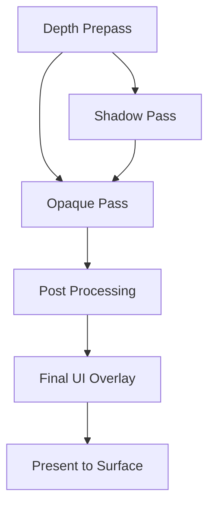

# Architecture Spec: Rendering & RenderGraph

Arisen Engine uses a **RenderGraph** architecture based on a **Directed Acyclic Graph (DAG)** to manage rendering operations. This system decouples the "what" of rendering (passes, dependencies, resources) from the "how" (GPU command submission, synchronization).

---

## 1. Core Packages

The rendering stack is composed of three primary layers:

1.  **`com.arisen.dag`**: The generic library for managing node dependencies and topological sorting.
2.  **`com.arisen.rendering`**: The domain package that translates the DAG into a rendering context, handles `RenderPass` primitives, and manages GPU resources (Textures, Buffers).
3.  **`com.arisen.rhi.vulkan.native`**: The native driver that translates the `RenderGraph`'s compiled passes into specialized Vulkan command buffers.

---

## 2. The RenderGraph Pattern

Unlike traditional "Forward" or "Deferred" pipelines that are hard-coded, the Arisen RenderGraph is built dynamically at runtime:

### Nodes as Passes
A `RenderPass` in Arisen is a node in the DAG. Each pass declares:
-   **Inputs**: The textures or buffers it needs to read from.
-   **Outputs**: The textures or buffers it will write to.

### Automatic Optimization
Because the engine knows the entire graph, it can perform several high-end optimizations automatically:
1.  **Resource Aliasing**: If two textures are never used at the same time, they can share the same physical GPU memory.
2.  **Automatic Barriers**: The graph automatically inserts `VkBarrier` or `PipelineBarrier` calls when an output of one node is used as an input for another.
3.  **Culling**: If a pass produces an output that is never consumed by the final display pass, that entire node (and its dependencies) is culled from the execution array.

---

## 3. Data-Driven Workflow

Render pipelines are defined as **RenderPipelineAssets**. These assets describe the graph structure.

### Generic Render Pipeline
The `com.arisen.generic-renderpipeline` package provides a baseline implementation that users can extend. It allows for:
-   **Custom Passes**: Users can inject their own `RenderPass` nodes into the existing graph via the `ServiceRegistry`.
-   **Runtime Modification**: The graph can be re-compiled dynamically if rendering settings change (e.g., enabling/disabling SSAO or Volumetric Fog).

---

## 4. Multi-Threading (TaskGraph)

Rendering execution is integrated with the `com.arisen.taskgraph` job system. 
-   **Command Recording**: Multiple render passes can record their native command buffers in parallel across different CPU cores.
-   **Submission**: The `RenderSubsystem` collects these buffers and submits them to the GPU queue in the correct topological order.

---

## 5. Viewport Integration

For the Editor, the `RenderGraph` supports a special "Shared Texture" mode. Instead of presenting directly to a native swapchain, the final output is exported as a Win32 Shared Handle, which is then consumed by the Avalonia-based Viewport using GPU-GPU interop for **Zero-Overhead** UI display.

---
*AI Guidance: When implementing new rendering features, ensure they are encapsulated as `RenderPass` nodes that can be managed by the RenderGraph. Avoid direct RHI calls outside of the Pass execution context.*
