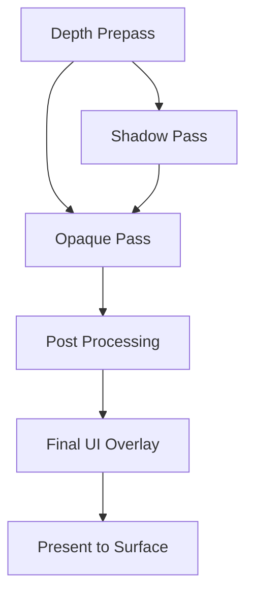
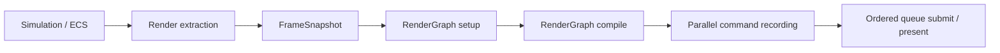

# Architecture Spec: Rendering & RenderGraph

Arisen Engine uses a **RenderGraph** architecture based on a **Directed Acyclic Graph (DAG)** to manage rendering operations. This system decouples the "what" of rendering (passes, dependencies, resources) from the "how" (GPU command submission, synchronization).

---

## 1. Core Packages

The rendering stack is composed of three primary layers:

1.  **`com.arisen.dag`**: The generic library for managing node dependencies and topological sorting.
2.  **`com.arisen.rendering`**: The core package providing the `RenderGraph` infrastructure, the `RenderPipeline` base class, and shared resource management.
3.  **`com.arisen.generic-renderpipeline`**: The baseline implementation package that provides standard passes (Clear, Geometry, etc.) for common rendering tasks.
4.  **`com.arisen.rhi.vulkan.native`**: The native driver that translates the `RenderGraph`'s compiled passes into specialized Vulkan command buffers.

---

## 2. The RenderGraph Pattern

Unlike traditional "Forward" or "Deferred" pipelines that are hard-coded, the Arisen RenderGraph is built dynamically at runtime:

### Nodes as Passes
A `RenderPass` in Arisen is a node in the DAG. Each pass declares:
-   **Inputs**: The textures or buffers it needs to read from.
-   **Outputs**: The textures or buffers it will write to.

### Automatic Optimization
Because the engine knows the entire graph, it can perform several high-end optimizations automatically:
1.  **Resource Aliasing**: If two textures are never used at the same time, they can share the same physical GPU memory.
2.  **Automatic Barriers**: The graph automatically inserts `VkBarrier` or `PipelineBarrier` calls when an output of one node is used as an input for another.
3.  **Culling**: If a pass produces an output that is never consumed by the final display pass, that entire node (and its dependencies) is culled from the execution array.

### RenderPipeline Orchestration
The `RenderPipeline` base class manages the lifecycle of the `RenderGraph`. Instead of manual rendering loops, developers override `SetupGraph()` to register their passes.
```csharp
protected override void SetupGraph(RenderGraph graph, RenderContext context)
{
    ReadOnlySpan<Camera> cameras = context.Cameras;
    graph.AddPass(new MyCustomPass());
}
```

---

## 3. Data-Driven Workflow

Render pipelines are defined as **RenderPipelineAssets**. These assets describe the graph structure.



### Generic Render Pipeline
The `com.arisen.generic-renderpipeline` package provides a baseline implementation that users can extend. It allows for:
-   **Custom Passes**: Users can inject their own `RenderPass` nodes into the existing graph via the `ServiceRegistry`.
-   **Parallel Construction**: The pipeline resolves the global `ITaskGraph` from the kernel to enable parallel command recording across multiple CPU cores.
-   **Runtime Modification**: The graph can be re-compiled dynamically if rendering settings change (e.g., enabling/disabling SSAO or Volumetric Fog).

---

## 4. Multi-Threading (TaskGraph)

Rendering execution is integrated with the `com.arisen.taskgraph` job system. 
-   **Command Recording**: Multiple render passes can record their native command buffers in parallel across different CPU cores.
-   **Submission**: The `RenderSubsystem` collects these buffers and submits them to the GPU queue in the correct topological order.

Current implementation:
- `RenderPipeline` owns a reusable `RenderGraph`.
- `RenderGraph` compiles pass dependencies into parallel layers.
- `RenderGraph` caches the compiled topology as pass-node ids and parallel-layer ids when the graph signature is stable, so steady-state frames can skip the DAG compiler while still resolving the current frame's pass instances.
- The generic DAG compiler reports dependency cycles with remaining node/edge context, and RenderGraph wraps compile failures with render pass graph state.
- RenderGraph validates that declared resources belong to the current frame graph, so stale transient resource handles fail during setup instead of during command recording.
- Each pass records through a `RenderCommandList`, which is the CPU-side facade over the current RHI command buffer.
- Worker threads use per-thread/per-surface command pools so command recording can happen concurrently.
- Small passes record as one pass-level work item; heavy passes may expose multiple `RenderPassWorkItem` ranges.
- `StaticMeshPass` is currently the first range-capable material/mesh pass. It prepares material pipeline batches from shader GUID, shader dependency stamp, material render state, and color/depth formats, then splits a pass-owned prepared draw-command array so command recording binds one compatible pipeline per batch.
- GPU submission remains ordered by the compiled graph's topological order.
- Profiles with `EnableProfiler: true` emit Tracy profiler zones for frame ticks, RenderGraph compile/record/submit work, TaskGraph layers, and worker-thread tasks.
- RenderGraph plots `RenderGraph.CompileCacheHit` so Tracy can show whether a frame reused the compiled topology.
- Frame-paced RenderGraph diagnostics log compiled pass order, compiled layers, resource access chains, current pass-culling status, per-layer work-item counts, zero-work skipped passes, and submit totals.

Target production flow:



Threading rules:
- Simulation must not be read directly by render worker threads. Rendering consumes a stable frame snapshot.
- `RenderSubsystem` extracts camera data, static mesh render items, any legacy prepared draw list, output target, surface, frame index, and timing data into `RenderFrameSnapshot` before RenderGraph setup/execution begins.
- Snapshot arrays are copied into `FrameArena` and exposed as `ReadOnlySpan<T>` from pointer/count pairs so command-recording tasks can capture the context without holding managed ECS buffers.
- Pass setup may resolve cached resources, but pass recording must not perform service-registry lookups, shader compilation, asset discovery, or unbounded allocation.
- The current smoke ShaderLab shader, smoke checker texture, and smoke mesh are referenced by stable asset GUIDs; ShaderLab parsing, shader cooking/loading, and GPU upload happen during pipeline/resource setup, not inside command recording. ShaderLab compile-time keyword declarations are validation metadata until a material explicitly selects `Shader.Keywords`; selected keywords are encoded into cooked shader variant names and pipeline variant identity. Runtime specialization constants are reserved for small non-layout constants and should not replace explicit cooked variants when shader interface or render-state compatibility changes.
- `RHITexture2DResource` is the first setup-time texture upload owner. It consumes cooked Texture2D bytes, creates an upload buffer, records a one-shot copy command buffer, transitions the image to shader-read layout, creates an image view and sampler, and registers both the image view and sampler in the global bindless table. It unregisters those bindless indices before releasing the sampler/image-view/image handles.
- `MaterialAssetCooker` converts authored material source into a cooked `material.runtime` payload. Shader source may declare required Texture2D/scalar/Vector4 bindings with lightweight `@arisen.material.*` annotations or a ShaderLab `MaterialContract` block; authored material source may also use the preferred `Shader.Contract` block on the shader reference, with material-level `ShaderContract` still accepted as a compatibility/extension path. Validation happens during source/cook/setup loading before GPU resource preparation. `RHIMaterialResource` consumes the cooked material model during setup, resolves Texture2D refs, uploads texture resources, and caches bindless image/sampler constants, typed scalar/Vector4 material property values, and authored or ShaderLab-derived render-state intent. BuildTool-generated material refs expose package-owned typed asset refs plus texture slot/property names for setup code. RenderGraph pass recording only pushes already-prepared unmanaged draw constants.
- `IRenderMaterialLibrary` is the first material registry contract. Scene/bootstrap code registers materials by stable GUID or `AssetRef<MaterialSourceAsset>` and receives compact material ids; the generic render pipeline provider prepares those GUID-backed materials into `RHIMaterialResource` instances during setup and feeds `StaticMeshPass` a material-slot snapshot.
- The first real mesh source is `TexturedQuad.obj`, loaded by generated asset GUID and cooked into an interleaved static mesh payload. Cooked mesh version 2 stores bounds and submesh metadata in addition to the vertex/index payload. Cooked mesh version 3 adds normals, and the first glTF static mesh importer scope now supports `.gltf` JSON triangle meshes with external or data-URI buffers, POSITION plus optional NORMAL/TEXCOORD_0/COLOR_0, unsigned indices, synthesized non-indexed triangle streams, material-slot extraction from primitive material indices, and external buffer write-time recooking. `RHIStaticMeshResource` creates setup-time upload staging buffers, copies into GPU-only vertex/index buffers, records a transfer-to-vertex-input buffer barrier, releases staging resources before frame recording, and exposes bounds/submesh spans to scene setup code. `RHIStaticMeshResource.CreateDrawCommands` can expand a prepared mesh into one `MeshDrawCommand` per selected submesh using caller-owned spans, with material ids offset by cooked material slots. `MeshRendererComponent` is asset-facing ECS data: mesh GUID, optional material GUID, submesh range, bounds, and visibility. `MeshSystem` extracts those components plus transforms into `StaticMeshRenderItem` snapshots. `GenericRenderPipeline` resolves those items during setup through its material library and GUID-keyed `RHIStaticMeshResource` cache, then expands them into pass-owned `MeshDrawCommand` arrays. `MeshDrawCommand` carries prepared RHI buffers plus `FirstIndex`, `IndexCount`, `VertexOffset`, `MaterialID`, and `LocalToWorld`, so draw recording can submit submesh-aware indexed draws without source-path lookup. `StaticMeshPass` declares the vertex input layout, builds graphics pipelines from prepared material render state, prepares per-draw object records into a bindless storage-buffer ring sized from `RHIInstance.MaxFramesInFlight`, unregisters each object-buffer bindless index before releasing its slot, binds the device-local buffers, pushes compact material/object indices, and records indexed draws from its prepared array; when no scene items or legacy draw list exist, it draws the fallback package asset's first submesh.
- Static mesh rendering now uses the first pass-owned depth target. `StaticMeshPass` creates and resizes a `FORMAT_D32_SFLOAT` image/view per surface size, transitions it from undefined on first use, clears it once for the first work item, and loads it for later work items. Pipelines include depth format in their reuse key and configure shared RHI depth testing/writes with `COMPARE_OP_LESS_OR_EQUAL`. The pass declares writes to `RenderGraph.FrameDepth` for ordering diagnostics, but concrete depth allocation remains pass-owned until the RenderGraph resource-planning milestone.
- Shader, material, texture, and mesh resources cache setup-time dependency stamps from asset source/meta files. `GenericRenderPipeline` subscribes to `IAssetDatabase.AssetChanged`, coalesces changed GUIDs in `RenderResourceReloadQueue`, and drains that queue during `SetupGraph` before pass preparation. Material, shader, texture, and fallback mesh GUID changes detach prepared GPU resources so replacements are created before command recording. Detached resources go through `DeferredRenderResourceDisposalQueue`, which releases only resources whose submitted ticket is already completed during normal frame submission, so bindless descriptor indices and GPU handles are not reused while in-flight command buffers may still reference them. Pipeline teardown performs a blocking drain after waiting the last submitted frame before releasing current resources. Dependency stamp polling remains as a safety fallback, and `StaticMeshPass` keys pipeline reuse on the shader dependency stamp as well as render-target format.
- `RenderCommandList` is the pass-facing command API. Passes should not directly depend on concrete native/Vulkan command buffer details.
- Large scene passes should split draw ranges into multiple record tasks instead of treating one RenderGraph pass as one CPU job.
- A pass may return zero work items only when it has no command work for the frame; dependency ordering still comes from the compiled graph, and submission skips that pass.
- Resource access diagnostics are derived from typed `RenderGraphBuilder` declarations, `FrameColor`/`FrameDepth`, and frame-boundary passes. The first planner turns those declarations into shared resource states such as color attachment, depth attachment, shader read, transfer read/write, and output ownership; it logs planned transitions and validates obvious invalid chains before command recording. RenderGraph records planned `FrameColor` acquire/release barriers before the boundary passes through shared `RHIImageMemoryBarrier`/`PipelineBarrier` APIs, while backend-specific layout and queue-family encoding stays inside concrete RHI packages. RenderGraph also performs conservative pass culling before compiling the executable layout: output ownership and side-effect passes are preserved, resource producers are walked backward, and culled pass names/counts are logged. Passes that use attachment load semantics must declare both a read and write for that attachment resource. Automatic resource allocation and fully graph-inserted barriers for pass-owned resources such as the first depth target remain future work.
- `RenderFrameSubmission` is the per-surface output owner for the current managed slice. It acquires the swapchain image, submits ordered graphics command buffers through the RHI device, applies first/last swapchain wait/signal ownership, presents the frame, and emits submission diagnostics.
- Future graphics/compute/copy queues should extend the submission owner rather than exposing backend queue details to render passes.

Profiling rules:
- Use the external Tracy Profiler viewer for full realtime timeline inspection.
- Keep the launcher/editor as a control surface for opening Tracy and launching profiler-enabled runs; do not embed Tracy's full UI in Avalonia yet.
- See `Profiling.md` for the current timeline workflow and profiler enablement policy.

---

## 5. Platform And RHI Surface Policy

Rendering does not own platform windows directly. It consumes surface/device contracts that are provided by selected packages.

Current policy:
- Standalone runtime builds create and pump the main Win32 window through `IWindowProvider`.
- Editor builds use the generated `ARISEN_ENGINE_EDITOR` compile-time macro. The Avalonia/editor host owns native UI windows, so the platform package must not create a separate standalone game window in editor builds.
- Runtime Vulkan initialization must consume `IWindowProvider.GetWindowInfo()` and validate a real `WindowSurfaceKind.Win32` native handle before registering `IRHIDevice`.
- Editor Vulkan initialization uses the virtual/device-only path for editor-hosted viewport surfaces. The viewport registers a virtual surface id with rendering; no standalone native game window is created in editor builds.
- Vulkan backend initialization logs setup-time adapter diagnostics through shared RHI instance exports: selected adapter name/type/driver IDs, enabled instance extensions, enabled device extensions, and missing device extensions. Rendering packages consume these as diagnostics only and remain backend-agnostic.
- Native RHI loader/backend failures are bridged into `RHISystem.LastInitializationError`, so failed Vulkan startup reports the concrete loader/export/backend reason. Vulkan setup diagnostics name missing mandatory instance/device extensions, rejected adapter feature requirements, selected adapter context, enabled extension lists, failed `VkResult` values, and likely missing runtime/SDK/driver requirements.
- Future DX12 and Metal packages should follow the same shared RHI contracts and backend capability model. The selected root/composition package chooses the concrete provider package; rendering/domain packages stay backend-agnostic.

Runtime Win32 surface boot and editor virtual/shared-texture surface boot are both supported by the current vertical slice. The remaining work is hardening lifecycle, diagnostics, and automated viewport validation.

---

## 6. Viewport Integration

The package editor uses a shared-texture viewport path:

- `EditorPackage` prefers Avalonia's Vulkan compositor on Windows so `TryGetCompositionGpuInterop()` can expose `VulkanOpaqueNtHandle`.
- `ArisenViewportControl` registers a virtual `SceneView` surface with `RenderSubsystem`, resizes it from the Avalonia control's physical pixel size, and pulls `RenderOutputInfo` for the latest rendered frame.
- `RenderSurface` maps the editor host id into the `RHISystem.VirtualSurfaceIDMask` range and creates/resizes an RHI virtual swapchain instead of a Win32 child window.
- Virtual surface resize increments a monotonic `RenderOutputInfo.ResizeGeneration`, invalidates stale shared-output metadata until a fresh frame is submitted at the new size, and lets the viewport clear imported-image caches on an explicit generation boundary.
- `RenderOutputPresentationState` centralizes viewport presentation validation for warmup frames, duplicate tickets, shared-handle/memory/size validity, compositor semaphore requirements, and resize-generation cache resets. Kernel tests cover this state machine so resize/import behavior has an automated validation seam outside Avalonia.
- The Vulkan swapchain exports image memory through `VK_EXTERNAL_MEMORY_HANDLE_TYPE_OPAQUE_WIN32_BIT` and exports synchronization through opaque Win32 semaphore handles.
- `PrepareFrameTargetPass` and `FinalOutputPass` own editor output layout/queue-family transitions so user render passes do not branch on editor/native presentation policy.
- The viewport waits for the render ticket, imports the exported image into Avalonia composition, and uses explicit semaphore update when the compositor requires it.

This path is intentionally setup/UI boundary work. RenderGraph pass recording must still consume already-created RHI resources and must not perform service lookup, asset discovery, or compositor interop inside pass recording.

---
*AI Guidance: When implementing new rendering features, ensure they are encapsulated as `RenderPass` nodes that can be managed by the RenderGraph. Passes should record through `RenderCommandList`; avoid direct native/backend calls outside package-owned RHI implementations.*
