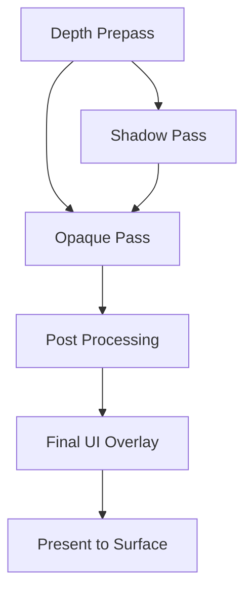

# Architecture Spec: Rendering & RenderGraph

Arisen Engine uses a **RenderGraph** architecture based on a **Directed Acyclic Graph (DAG)** to manage rendering operations. This system decouples the "what" of rendering (passes, dependencies, resources) from the "how" (GPU command submission, synchronization).

---

## 1. Core Packages

The rendering stack is composed of three primary layers:

1.  **`com.arisen.dag`**: The generic library for managing node dependencies and topological sorting.
2.  **`com.arisen.rendering`**: The core package providing the `RenderGraph` infrastructure, the `RenderPipeline` base class, and shared resource management.
3.  **`com.arisen.generic-renderpipeline`**: The baseline implementation package that provides standard passes (Clear, Geometry, etc.) for common rendering tasks.
4.  **`com.arisen.rhi.vulkan.native`**: The native driver that translates the `RenderGraph`'s compiled passes into specialized Vulkan command buffers.

---

## 2. The RenderGraph Pattern

Unlike traditional "Forward" or "Deferred" pipelines that are hard-coded, the Arisen RenderGraph is built dynamically at runtime:

### Nodes as Passes
A `RenderPass` in Arisen is a node in the DAG. Each pass declares:
-   **Inputs**: The textures or buffers it needs to read from.
-   **Outputs**: The textures or buffers it will write to.

### Automatic Optimization
Because the engine knows the entire graph, it can perform several high-end optimizations automatically:
1.  **Resource Aliasing**: If two textures are never used at the same time, they can share the same physical GPU memory.
2.  **Automatic Barriers**: The graph automatically inserts `VkBarrier` or `PipelineBarrier` calls when an output of one node is used as an input for another.
3.  **Culling**: If a pass produces an output that is never consumed by the final display pass, that entire node (and its dependencies) is culled from the execution array.

### RenderPipeline Orchestration
The `RenderPipeline` base class manages the lifecycle of the `RenderGraph`. Instead of manual rendering loops, developers override `SetupGraph()` to register their passes.
```csharp
protected override void SetupGraph(RenderGraph graph, RenderContext context, ReadOnlySpan<Camera> cameras)
{
    graph.AddPass(new MyCustomPass());
}
```

---

## 3. Data-Driven Workflow

Render pipelines are defined as **RenderPipelineAssets**. These assets describe the graph structure.



### Generic Render Pipeline
The `com.arisen.generic-renderpipeline` package provides a baseline implementation that users can extend. It allows for:
-   **Custom Passes**: Users can inject their own `RenderPass` nodes into the existing graph via the `ServiceRegistry`.
-   **Parallel Construction**: The pipeline resolves the global `ITaskGraph` from the kernel to enable parallel command recording across multiple CPU cores.
-   **Runtime Modification**: The graph can be re-compiled dynamically if rendering settings change (e.g., enabling/disabling SSAO or Volumetric Fog).

---

## 4. Multi-Threading (TaskGraph)

Rendering execution is integrated with the `com.arisen.taskgraph` job system. 
-   **Command Recording**: Multiple render passes can record their native command buffers in parallel across different CPU cores.
-   **Submission**: The `RenderSubsystem` collects these buffers and submits them to the GPU queue in the correct topological order.

---

## 5. Platform And RHI Surface Policy

Rendering does not own platform windows directly. It consumes surface/device contracts that are provided by selected packages.

Current policy:
- Standalone runtime builds create and pump the main Win32 window through `IWindowProvider`.
- Editor builds use the generated `ARISEN_ENGINE_EDITOR` compile-time macro. The Avalonia/editor host owns native UI windows, so the platform package must not create a separate standalone game window in editor builds.
- Runtime Vulkan initialization must consume `IWindowProvider.GetWindowInfo()` and validate a real `WindowSurfaceKind.Win32` native handle before registering `IRHIDevice`.
- Editor Vulkan initialization may use a virtual/device-only path until editor-hosted viewport surfaces are implemented.
- Future DX12 and Metal packages should follow the same shared RHI contracts and backend capability model. The selected root/composition package chooses the concrete provider package; rendering/domain packages stay backend-agnostic.

The next runtime rendering step is replacing the temporary runtime device-only Vulkan bootstrap with a real Win32 surface and swapchain creation path.

---

## 6. Viewport Integration

For the Editor, the RenderGraph should support an editor-hosted viewport surface instead of assuming the standalone runtime window path. The long-term target is a shared texture/shared handle path consumed by the Avalonia viewport. Simpler staged or virtual surfaces may be used as transitional diagnostics, but editor integration must still go through explicit package services and RHI contracts.

---
*AI Guidance: When implementing new rendering features, ensure they are encapsulated as `RenderPass` nodes that can be managed by the RenderGraph. Avoid direct RHI calls outside of the Pass execution context.*
