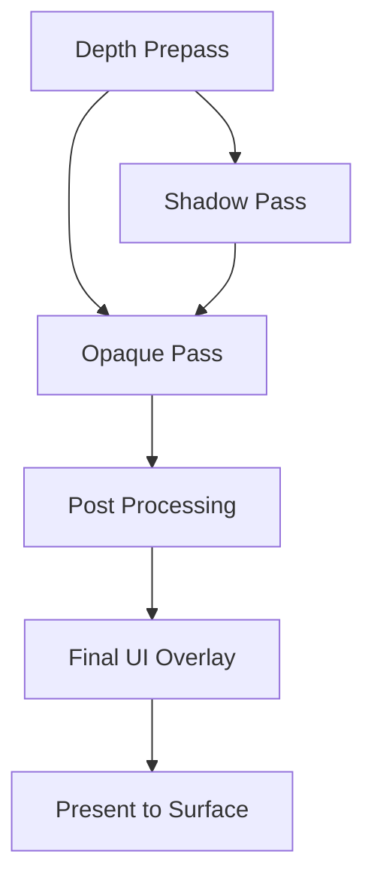
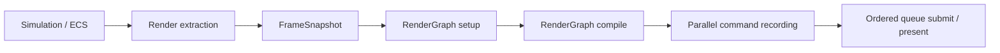

# Architecture Spec: Rendering & RenderGraph

Arisen Engine uses a **RenderGraph** architecture based on a **Directed Acyclic Graph (DAG)** to manage rendering operations. This system decouples the "what" of rendering (passes, dependencies, resources) from the "how" (GPU command submission, synchronization).

---

## 1. Core Packages

The rendering stack is composed of three primary layers:

1.  **`com.arisen.dag`**: The generic library for managing node dependencies and topological sorting.
2.  **`com.arisen.rendering`**: The core package providing the `RenderGraph` infrastructure, the `RenderPipeline` base class, and shared resource management.
3.  **`com.arisen.generic-renderpipeline`**: The baseline implementation package that provides standard passes (Clear, Geometry, etc.) for common rendering tasks.
4.  **`com.arisen.rhi.vulkan.native`**: The native driver that translates the `RenderGraph`'s compiled passes into specialized Vulkan command buffers.

---

## 2. The RenderGraph Pattern

Unlike traditional "Forward" or "Deferred" pipelines that are hard-coded, the Arisen RenderGraph is built dynamically at runtime:

### Nodes as Passes
A `RenderPass` in Arisen is a node in the DAG. Each pass declares:
-   **Inputs**: The textures or buffers it needs to read from.
-   **Outputs**: The textures or buffers it will write to.

### Automatic Optimization
Because the engine knows the entire graph, it can perform several high-end optimizations automatically:
1.  **Resource Aliasing**: If two textures are never used at the same time, they can share the same physical GPU memory.
2.  **Automatic Barriers**: The graph automatically inserts `VkBarrier` or `PipelineBarrier` calls when an output of one node is used as an input for another.
3.  **Culling**: If a pass produces an output that is never consumed by the final display pass, that entire node (and its dependencies) is culled from the execution array.

### RenderPipeline Orchestration
The `RenderPipeline` base class manages the lifecycle of the `RenderGraph`. Instead of manual rendering loops, developers override `SetupGraph()` to register their passes.
```csharp
protected override void SetupGraph(RenderGraph graph, RenderContext context)
{
    ReadOnlySpan<Camera> cameras = context.Cameras;
    graph.AddPass(new MyCustomPass());
}
```

---

## 3. Data-Driven Workflow

Render-pipeline implementations and pass topology are code-defined. A workspace selects one package-owned `RenderPipelineSettings` asset through `manifest.json`; the concrete `IRenderPipelineProvider` loads that asset and creates the corresponding `RenderPipelineAsset`. Serialized settings hold durable quality policy, not an arbitrary executable pass graph.



### Generic Render Pipeline
The `com.arisen.generic-renderpipeline` package provides the current baseline implementation:
- **Composition selection**: the package registers `IRenderPipelineProvider`; it no longer assigns a development default during package load.
- **Serialized quality**: `.arisrenderpipeline` assets index as `RenderPipelineSettings`. Version 1 stores fallback clear color plus directional-shadow enablement, map size, receiver depth/slope bias, strength, and PCF radius.
- **Code-owned graph**: `GenericRenderPipeline.SetupGraph` still defines pass topology and can recompile its reusable graph when that code-defined signature changes.
- **Parallel construction**: the pipeline resolves the global `ITaskGraph` from the kernel to record independent pass work across multiple CPU cores.

---

## 4. Multi-Threading (TaskGraph)

Rendering execution is integrated with the `com.arisen.taskgraph` job system. 
-   **Command Recording**: Multiple render passes can record their native command buffers in parallel across different CPU cores.
-   **Submission**: The `RenderSubsystem` collects these buffers and submits them to the GPU queue in the correct topological order.

Current implementation:
- `RenderPipeline` owns a reusable `RenderGraph`.
- `RenderGraph` compiles pass dependencies into parallel layers.
- `RenderGraph` caches the compiled topology as pass-node ids and parallel-layer ids when the graph signature is stable, so steady-state frames can skip the DAG compiler while still resolving the current frame's pass instances.
- The generic DAG compiler reports dependency cycles with remaining node/edge context, and RenderGraph wraps compile failures with render pass graph state.
- RenderGraph validates that declared resources belong to the current frame graph, so stale transient resource handles fail during setup instead of during command recording.
- Each pass records through a `RenderCommandList`, which is the CPU-side facade over the current RHI command buffer.
- Worker threads use per-thread/per-surface command pools so command recording can happen concurrently.
- `TaskGraphPackage` owns the single shared worker pool. RenderGraph uses the one-shot `AddTask`/`Execute` mode because recording work is rebuilt from each frame, while ECS uses `ITaskSchedule` to compile stable system topology once and execute it repeatedly with updated world/time context.
- Task dispatch uses value-type queue records and a reusable completion batch instead of allocating an `ActionTask` wrapper and `CountdownEvent` per submitted task. Worker failures are returned to the waiting engine thread after the current layer completes.
- Small passes record as one pass-level work item; heavy passes may expose multiple `RenderPassWorkItem` ranges.
- `StaticMeshPass` is currently the first range-capable material/mesh pass. It prepares material pipeline batches from shader GUID, shader dependency stamp, material render state, and color/depth formats, then splits a pass-owned prepared draw-command array so command recording binds one compatible pipeline per batch.
- Vertex-buffer bindings are draw-local at execution. A pass may queue multiple vertex bindings for one draw, but the Vulkan executor clears that pending binding list after every direct or indirect draw so later meshes cannot inherit an earlier binding-zero buffer.
- GPU submission remains ordered by the compiled graph's topological order.
- Profiles with `EnableProfiler: true` emit Tracy profiler zones for frame ticks, RenderGraph compile/record/submit work, TaskGraph layers, and worker-thread tasks.
- RenderGraph plots `RenderGraph.CompileCacheHit` so Tracy can show whether a frame reused the compiled topology.
- Frame-paced RenderGraph diagnostics log compiled pass order, compiled layers, resource access chains, current pass-culling status, per-layer work-item counts, zero-work skipped passes, and submit totals.
- Visual scene diagnostics are setup/extraction-owned. `RenderSubsystem` plots snapshot counts for cameras, static mesh items, directional lights, point lights, spot lights, scene environments, and output size. `GenericRenderPipeline` plots registered/prepared material counts, accepted light/environment counts, visible draw commands after culling, scene-color dimensions/format, and shadow-map enabled/size state. `StaticMeshPass` plots draw, material batch, queue class, work-item, point-light, spot-light, and object-buffer counts, while `DirectionalShadowPass` plots shadow draw count, map size, and enabled state. Throttled setup logs include mesh, material, light, environment, culling, and visible draw summaries.

Target production flow:



Threading rules:
- Simulation must not be read directly by render worker threads. Rendering consumes a stable frame snapshot.
- `SceneSubsystem` owns one `EntityManager` for its initialized lifetime. Persistent and additive scene instances contribute generation-checked entities to that same world; scene switching and cell unload never swap the manager out from under systems or extraction.
- Runtime scene activation and unload are structural operations processed at `EngineKernel.OnFrameEnd`. A validated scene becomes visible to ECS systems and render extraction on the following frame. Unload removes only the instance-owned entities before the following extraction, with stable dense-pool compaction preserving surviving order.
- Render/ECS inner loops use the dense `Entity` values stored beside component arrays. The handle's generation participates in sparse membership checks, but authoring GUID maps and scene-instance ownership dictionaries remain setup/tooling data and are never queried per draw, light, or entity iteration.
- `RenderSubsystem` extracts camera data, static mesh render items, any legacy prepared draw list, output target, surface, frame index, and timing data into `RenderFrameSnapshot` before RenderGraph setup/execution begins.
- Snapshot arrays are copied into `FrameArena` and exposed as `ReadOnlySpan<T>` from pointer/count pairs so command-recording tasks can capture the context without holding managed ECS buffers.
- Pass setup may resolve cached resources, but pass recording must not perform service-registry lookups, shader compilation, asset discovery, or unbounded allocation.
- The current smoke ShaderLab shader, smoke checker texture, and smoke mesh are referenced by stable asset GUIDs; ShaderLab parsing, shader cooking/loading, and GPU upload happen during pipeline/resource setup, not inside command recording. ShaderLab compile-time keyword declarations are validation metadata until a material explicitly selects `Shader.Keywords`; selected keywords are encoded into cooked shader variant names and pipeline variant identity. Runtime specialization constants are reserved for small non-layout constants and should not replace explicit cooked variants when shader interface or render-state compatibility changes.
- `RHITexture2DResource` is the first setup-time texture upload owner. It consumes cooked Texture2D bytes, creates an upload buffer, records a one-shot copy command buffer, transitions the image to shader-read layout, creates an image view and the binding-resolved sampler, and registers both the image view and sampler in the global bindless table. Binding-local min/mag filter, mip mode, and per-axis wrap settings are mapped to shared RHI enums during setup. It unregisters those bindless indices before releasing the sampler/image-view/image handles.
- `MaterialAssetCooker` converts authored material source into a cooked `material.runtime` payload. Shader source may declare required Texture2D/scalar/Vector4 bindings with lightweight `@arisen.material.*` annotations or a ShaderLab `MaterialContract` block; authored material source may also use the preferred `Shader.Contract` block on the shader reference, with material-level `ShaderContract` still accepted as a compatibility/extension path. Validation happens during source/cook/setup loading before GPU resource preparation. Version 6 carries optional sampler settings and UV transform metadata per Texture2D binding; omitted values resolve deterministically. `RHIMaterialResource` consumes the cooked material model during setup, resolves Texture2D refs, uploads texture resources, and caches bindless image/sampler constants, texture transforms, typed scalar/Vector4 material property values, and authored or ShaderLab-derived render-state intent. BuildTool-generated material refs expose package-owned typed asset refs plus texture slot/property names for setup code. The standard material names include `BaseColor`, `Normal`, optional `Emissive`, packed `MetallicRoughness`, optional `Occlusion`, `MetallicFactor`, `RoughnessFactor`, `OcclusionStrength`, `AlphaCutoff`, `BaseColorFactor`, and `EmissiveFactor`; packed channels are `R=occlusion`, `G=roughness`, and `B=metallic`. RenderGraph pass recording only consumes already-prepared unmanaged draw and object constants.
- `GenericRP/StandardLit` is the first production-facing ShaderLab material contract and is now the generic render pipeline's default material. It requires base-color and normal textures, metallic/roughness scalars, a base-color factor, and an emissive factor; it also supports optional `Emissive`, packed `MetallicRoughness`, and `Occlusion` Texture2D slots plus deterministic occlusion-strength and alpha-cutoff defaults. It declares explicit `USE_NORMAL_MAP`, `ALPHA_TEST`, and `USE_TRIPLANAR` compile-time keyword variants. The default path samples tangent-space normals from cooked static mesh tangents, while the triplanar path projects base color from world position for meshes whose authored UV islands would visibly repeat a surface texture. Packed metallic-roughness multiplies the authored roughness from green and metallic from blue; occlusion reads red, applies authored strength, and attenuates only ambient/indirect diffuse and specular. Direct lighting and emissive remain unoccluded. The `ALPHA_TEST` variant clips sampled base-color alpha against the authored `AlphaCutoff` before fragment color/depth output. The package-owned `StandardLitMaterial` and flat `DefaultNormal` texture are generated as typed asset refs. `StaticMeshPass` resolves all material properties and optional texture bindings during setup, then stores emissive/PBR factors, presence flags, and bindless indices in each draw's storage-buffer object record instead of widening the already packed push constants. It also appends three aligned environment-lighting records containing prepared irradiance, prefiltered-specular, and BRDF-LUT indices plus rotation, intensity, max LOD, and an enabled flag; the draw push-constant contract remains 124 bytes. Command recording stays allocation-free and source-asset-free. The direct-light model is Cook-Torrance with GGX distribution, Smith visibility, and Schlick Fresnel; directional, point, and spot lights share that BRDF. When IBL is valid, StandardLit samples lat-long irradiance by world normal, samples the prefiltered reflection at `roughness * maxLod`, applies the split-sum BRDF LUT and roughness-aware Schlick energy weighting, and scales indirect light by authored environment and scene ambient intensities. Missing IBL retains the deterministic colored-ambient formula. Direct lights and material emission remain in linear HDR scene color.
- `DirectionalLightComponent` is the first scene-authored light source. `.arisenscene` assets may contain `DirectionalLight` blocks with direction-to-light, color, intensity, ambient intensity, and enabled data. The current StandardLit path has an explicit one-directional-light-per-surface/frame limit: `DirectionalLightSnapshotExtractor` scans the contiguous ECS pool without allocation, accepts the first enabled light into `FrameArena`, and reports source, enabled, accepted, and dropped counts. `RenderSubsystem` exposes the accepted snapshot, plots the counts in Tracy, and emits a throttled overflow warning. `GenericRenderPipeline` uses that accepted light or a deterministic default; `StaticMeshPass` turns it into compact unmanaged constants during setup, and `StandardLit` consumes those constants for direct plus ambient lighting.
- `PointLightComponent` and `SpotLightComponent` are the first local light sources. Point-light position comes from `TransformComponent`; spot-light position and cone axis come from `TransformComponent.Position` and local `+Z` rotation. Authored local-light data stores RGB color, intensity, range, and enabled state; spot lights additionally store inner/outer cone angles. `PointLightSnapshotExtractor` and `SpotLightSnapshotExtractor` scan contiguous component pools plus matching entity spans, resolve transforms from the transform pool, accept up to four enabled lights of each type per frame, and report source, enabled, accepted, missing-transform, and dropped counts. `StaticMeshPass` appends point-light records after per-object records and spot-light records after point lights in the existing bindless object-data upload buffer. Point and spot counts are packed into the existing local-light count push-constant field, avoiding widened push constants or a new descriptor binding. `StandardLit` reads those records in the fragment stage, applies range/cone attenuation, and evaluates the same GGX direct-light function used by the directional light. Environment image-based lighting is evaluated separately as indirect light and does not change local-light records or loops.
- `SceneEnvironmentComponent` is the scene-authored environment source. `.arisenscene` `Environment` blocks provide an optional `EnvironmentTexture` GUID/package reference plus sky, horizon, ground, and ambient colors with independent sky/ambient intensity. `SceneEnvironmentSnapshotExtractor` scans the contiguous component pool without allocation, accepts one enabled environment per surface/frame, and copies the GUID and numeric data into `RenderFrameSnapshot`; no managed ECS storage is exposed to render workers. Scene inspection resolves the optional ref as `EnvironmentTexture` and reports missing/wrong-type references without turning source parsing into render work.
- `EnvironmentTextureAssetLoader` parses `.arienvironment` metadata during setup, and `EnvironmentTextureAssetCooker` converts strict 2:1 lat-long PPM/PNG/JPEG or float HDR input into a linear `R16G16B16A16_SFLOAT` cooked payload. `RHIEnvironmentTextureResource` uploads that payload once through the common synchronous 2D allocation owner, uses repeat-U/clamp-V sampling, and registers bindless image/sampler indices. Combined descriptor/source dependency stamps drive deferred-safe hot replacement.
- `EnvironmentLightingAssetCooker` derives setup-ready IBL data from the cooked linear panorama and caches it as `ibl.latlong.rgba16f.v1`: a 32x16 cosine-convolved diffuse-radiance map, a 128x64 GGX-prefiltered specular map with eight roughness mips, and a 128x128 split-sum BRDF integration LUT. `RHIEnvironmentLightingResource` uploads and owns those three half-float textures, exposes their bindless image/sampler indices plus specular max LOD, and follows the same dependency-stamp and deferred-disposal policy as the visible panorama. The common uploader accepts tightly packed mip chains, records one copy region per mip, uses a full-chain sampler LOD range, and transitions all mips before shader access. Generation and upload run only during pipeline setup; pass recording receives prepared data only.
- `EnvironmentSkyPass` uses a vertex-buffer-free fullscreen triangle and setup-prepared push constants. When a prepared environment resource exists, the fragment shader reconstructs a world direction from the primary camera basis/FOV/aspect, maps it to lat-long UV with authored rotation, and samples the bindless linear half-float image into HDR scene color. When the scene omits the ref or parsing/cooking/upload fails, the same shader retains the previous procedural ground/horizon/sky gradient. Shader cooking, asset resolution, GPU upload, and pipeline creation happen before recording; `Record` only binds prepared state/constants and draws three vertices. StandardLit uses the same lat-long direction and rotation convention for setup-owned irradiance and reflection resources, so the visible sky and material lighting remain aligned.
- `RenderGraphTexture` owns reusable transient texture allocations requested by a pipeline. `GenericRenderPipeline` requests `SceneColor` as a `FORMAT_R16G16B16A16_SFLOAT` color-attachment/sampled image, `FrameDepth` as a depth-only `FORMAT_D32_SFLOAT` attachment, and `DirectionalShadowMap` as a settings-sized `FORMAT_D32_SFLOAT` depth-attachment/sampled image. The graph owns each image/view allocation, deferred-safe replacement through the render-resource disposal queue, and current resource state across frames. Sampling capabilities are descriptor-driven: scene color and the shadow map receive samplers plus bindless image/sampler registrations, while frame depth allocates neither until a later pass actually needs shader sampling.
- `TonemapPass` is the first explicit output pass. It samples the HDR scene color through prepared bindless indices, applies exposure plus an ACES-style filmic curve, then writes the current swapchain or editor shared output. Exposure is a scene-authored linear multiplier carried through `SceneEnvironmentComponent` and the immutable frame snapshot; omission preserves the `1.0` baseline, finite values clamp to `[0, 64]`, and non-finite values resolve to `1.0`. `GenericRenderPipeline` prepares that value before recording, and automatic exposure is intentionally deferred. Because scene color is written through the RHI top-left viewport contract and then read back as a texture, the pass flips the sampled V coordinate once when mapping fullscreen output pixels back to scene-color texels. It is now the only generic pipeline pass that performs explicit sRGB encoding for eight-bit UNORM outputs such as the editor's shared `R8G8B8A8_UNORM` image; native sRGB swapchains use fixed-function encoding, and floating-point outputs stay linear.
- `DirectionalShadowPass` provides the first directional shadow-map slice against the prepared graph-owned shadow texture. It receives only the image view, format, and dimensions needed for recording; allocation, bindless registration, deferred-safe replacement, disposal, and layout state remain in `RenderGraphTexture`. The pass records through `RenderCommandList.BeginRenderingDepthOnly`, uses a package-owned `DirectionalShadow.hlsl` vertex-only depth shader, and replays a setup-owned shadow-caster `MeshDrawCommand` span before the lit pass. Its depth-write declaration and the static-mesh shader-read declarations drive the graph-planned transition, so the pass performs no manual image transition. `DirectionalShadowFitter` unions bounded camera-visible receivers, transforms their world AABB into a stable world-origin light basis, pads a square orthographic slice, and snaps its light-space XY center to selected-map texels. Missing usable bounds retain the fixed showcase projection. Map size, shadow enablement, receiver depth/slope bias, strength, and PCF radius come from the selected Generic RP settings asset; raster depth bias remains future RHI work. `StaticMeshPass` appends the prepared light-space matrix and compact sampling parameters to its existing per-object storage-buffer records, so `StandardLit` performs configurable PCF without increasing push-constant size or doing recording-time asset/service work.
- Static mesh queue policy is explicit and setup-owned. `RenderQueuePolicy` resolves opaque materials to queue `2000`, alpha-test materials to queue `2450` when the cooked shader keyword set contains `ALPHA_TEST`, and blend-enabled materials to queue `3000`. `GenericRenderPipeline` partitions camera-visible commands into reusable depth-writing and transparent spans before pass preparation. The opaque/alpha-test pass sorts by queue, pipeline batch, material id, mesh buffers, submesh offset, and original draw index for deterministic pipeline-friendly submission. `TransparentDrawOrdering` instead sorts transparent commands by descending camera-space depth from the transformed local origin and preserves source order for equal-depth ties. A dedicated transparent `StaticMeshPass` keeps that prepared order, runs after opaque HDR lighting, loads and tests the opaque depth attachment with `COMPARE_OP_LESS_OR_EQUAL`, disables depth writes, and uses each material's prepared blend state. RenderGraph work-item command buffers remain parallel-recorded but are submitted in sorted index order. Transparent materials are excluded from the depth-only directional shadow caster span; alpha-test materials remain depth-writing and shadow eligible.
- Static mesh culling is setup-owned. `StaticMeshFrustumCuller` resolves conservative world AABBs from extracted `StaticMeshRenderItem` bounds, falling back to cooked mesh bounds, and tests those bounds against a supplied view-projection. `GenericRenderPipeline` first builds the compact primary-camera-visible draw span and receiver bounds, then performs a second conservative traversal against the fitted light frustum into a distinct reusable shadow-caster draw span. Items without usable bounds remain conservatively visible. Both spans are expanded by submesh into caller-owned arrays before pass preparation; command recording performs no scene queries, service lookup, culling, or managed allocation. Tracy exposes source/visible/culled item counts, bounded receiver count, camera draw count, shadow draw count, fitted/fallback mode, fitted diameter/depth, and world units per shadow texel.
- The current directional-shadow policy remains one map for one accepted directional light. The first later large-scene cascade design is four camera-frustum slices using a practical logarithmic/linear split, an authored maximum shadow distance and terminal fade, independent receiver fitting plus texel snapping per slice, compact per-cascade caster spans, and a depth-array shadow target sampled by linear camera depth. Cascade count, split weighting, distance, and per-tier map size belong to serialized pipeline quality settings. Per-cascade culling and matrix preparation remain setup-owned; pass recording receives flat cascade/draw ranges. Cascades are deferred until outdoor-scale camera ranges justify their GPU, memory, and variant cost.
- Visual diagnostics are not part of the draw-recording contract. New counters should be emitted during extraction, setup, pass preparation, or once per pass work item, not per entity or per draw unless the pass is already iterating that data for required command emission.
- `IRenderMaterialLibrary` is the first material registry contract. Scene/bootstrap code registers materials by stable GUID or `AssetRef<MaterialSourceAsset>` and receives compact material ids; the generic render pipeline provider prepares those GUID-backed materials into `RHIMaterialResource` instances during setup and feeds `StaticMeshPass` a material-slot snapshot.
- `IRenderPipelineProvider` is the composition-facing pipeline contract. The root package depends on the concrete provider package and requires the service; `RenderSubsystem` consumes the single selected provider once during initialization and asks it to activate the settings GUID/package identity from the manifest. The reference package owns the asset and can be the game package; provider selection comes from composition. Generic RP owns its loader and schema validation, while shared rendering owns no Generic RP implementation dependency. During shutdown, `RenderSubsystem` first disposes the active pipeline and drains its ticket-safe queue, then invokes the provider's idempotent device-resource release hook before any selected RHI package can unload. This ordering is backend-neutral and applies equally to Vulkan, DX12, and Metal providers.
- Scene ownership is shared across product boot and editor tooling through `IRuntimeSceneService`. The workspace manifest selects one package-owned startup scene; `ProjectSceneBootstrapSubsystem` loads it during `PostInit` into a temporary `EntityManager`, and only a successful source-v2 or cooked-v2 scene result replaces the world consumed by `SceneSubsystem`. `IEditorSceneDocumentService` owns the editor's saved and working `.arisenscene` source for that same GUID/package identity. Inspector commands target persistent authoring entity GUIDs, stage immutable source revisions, and queue `SceneSourceSnapshot` previews through the coalesced runtime boundary drained by `ResourcesPackage` at `EngineKernel.OnFrameEnd`; they never mutate live ECS from Avalonia's thread and do not persist until explicit Save. Failed snapshots preserve the prior runtime world, while dirty switching and shutdown require Save/Discard/Cancel resolution. Source and cooked staging canonicalize by authoring GUID, build a compact setup-time GUID-to-dense-entity map, and resolve local hierarchy only after all entities exist. Production consumes the cooked payload and does not parse source YAML; render extraction continues to use contiguous ECS components and never performs authoring-GUID lookup.
- The first real mesh source was `TexturedQuad.obj`; the generic pipeline retains `FacetedCrystal.obj` as its package-owned visual fallback. The default application scene now lives at the correct composition boundary in `com.arisen.packagegame`: `LanternShowcaseScene.arisenscene` frames generated children from the package-owned Khronos Lantern GLB model root, while the older Utah teapot/pedestal/ground scene remains secondary diagnostic content. Cooked mesh version 2 stores bounds and submesh metadata in addition to the vertex/index payload. Cooked mesh version 3 adds normals, and the first glTF static mesh importer scope now supports `.gltf` JSON triangle meshes with external or data-URI buffers plus `.glb` binary containers with embedded BIN chunks, POSITION plus optional NORMAL/TANGENT/TEXCOORD_0/COLOR_0, unsigned indices, synthesized non-indexed triangle streams, selected-scene node traversal, matrix/TRS node transforms baked into cooked static vertices, material-slot extraction from primitive material indices, and external buffer write-time recooking for JSON `.gltf` dependencies. Raw `.gltf` / `.glb` files remain mesh assets in this path; production model roots use the separate `ModelSourceAsset` identity, and `GltfModelImportEmitter` can generate package-owned scene, single-mesh source, material, and texture children with stable GUIDs. Generated scenes map each glTF primitive to one mesh-renderer submesh range with that primitive's generated material GUID, while generated mesh sources strip scene/node transforms to avoid double-applying placement. Generated materials use sRGB base-color/emissive variants and linear normal/metallic-roughness/occlusion variants, preserve binding-local glTF sampler and `KHR_texture_transform` metadata, deduplicate shared physical image children, select the explicit `USE_NORMAL_MAP` cooked variant when a normal binding is emitted, map `alphaMode: MASK` to the explicit `ALPHA_TEST` material keyword plus cutoff, and map `alphaMode: BLEND` to straight-alpha blend state consumed by the transparent queue. Nonzero imported UV sets remain diagnostic-only until the mesh/shader path supports them. `RHIStaticMeshResource` creates setup-time upload staging buffers, copies into GPU-only vertex/index buffers, records a transfer-to-vertex-input buffer barrier, releases staging resources before frame recording, and exposes bounds/submesh spans to scene setup code. `RHIStaticMeshResource.CreateDrawCommands` can expand a prepared mesh into one `MeshDrawCommand` per selected submesh using caller-owned spans, with material ids offset by cooked material slots; `CreateDrawCommandsWithMaterialOverride` expands the same ranges while preserving the caller's exact material id for generated per-primitive scene bindings. `MeshRendererComponent` is asset-facing ECS data: mesh GUID, optional material GUID, submesh range, bounds, and visibility. Authored `.arisenscene` assets now provide the first source-driven scene loading path: package setup loads a generated `AssetRef<SceneSourceAsset>`, validates mesh/material refs through `IAssetDatabase`, and spawns ECS camera/transform/mesh-renderer components before render extraction. `MeshSystem` extracts those components plus transforms into `StaticMeshRenderItem` snapshots. `GenericRenderPipeline` resolves those items during setup through its material library and GUID-keyed `RHIStaticMeshResource` cache, then expands them into pass-owned `MeshDrawCommand` arrays; items with explicit material GUIDs use exact material overrides, while mesh-only items may still use cooked material-slot offsets. `MeshDrawCommand` carries prepared RHI buffers plus `FirstIndex`, `IndexCount`, `VertexOffset`, `MaterialID`, and `LocalToWorld`, so draw recording can submit submesh-aware indexed draws without source-path lookup. `StaticMeshPass` declares the vertex input layout, builds graphics pipelines from prepared material render state and pass depth-write policy, prepares per-draw object records into a bindless storage-buffer ring sized from `RHIInstance.MaxFramesInFlight`, unregisters each object-buffer bindless index before releasing its slot, binds the device-local buffers, pushes compact material/object indices, and records indexed draws from its prepared array; when no scene items or legacy draw list exist, the opaque pass draws the fallback package asset's first submesh.
- Static mesh rendering uses one graph-owned `FrameDepth` transient shared by the opaque/alpha-test and transparent passes. `GenericRenderPipeline` binds the prepared image view and format into both passes; `StaticMeshPass` no longer allocates, resizes, releases, or manually transitions a depth image. The opaque pass declares `ClearThenLoad/Store` read/write depth attachment use because its first work item clears and writes while later work items load/test/write. If no eligible draw or fallback exists, it retains one clear-only work item so a later transparent pass cannot load uninitialized depth. The transparent pass declares `ReadOnlyLoad/Store`, loads the opaque result with `COMPARE_OP_LESS_OR_EQUAL`, uses `IMAGE_LAYOUT_DEPTH_STENCIL_READ_ONLY_OPTIMAL`, and disables depth writes. RenderGraph records the undefined/previous-frame-to-write barrier and the write-to-read-only barrier. Pipeline keys retain depth-write policy and depth format.
- Shader, material, texture, environment texture/lighting, and mesh resources cache setup-time dependency stamps from asset source/meta files. `GenericRenderPipeline` subscribes to `IAssetDatabase.AssetChanged`, coalesces changed GUIDs in `RenderResourceReloadQueue`, and drains that queue during `SetupGraph` before pass preparation. Material, shader, texture, environment descriptor/source, and fallback mesh GUID changes detach prepared GPU resources so replacements are created before command recording. Detached resources go through `DeferredRenderResourceDisposalQueue`, which releases only resources whose submitted ticket is already completed during normal frame submission, so bindless descriptor indices and GPU handles are not reused while in-flight command buffers may still reference them. Pipeline teardown performs a blocking drain after waiting the last submitted frame before releasing current resources. Dependency stamp polling remains as a safety fallback, and `StaticMeshPass` keys pipeline reuse on the shader dependency stamp as well as render-target format.
- World streaming couples that safety to cell lifetime through `IRuntimeAssetResidencyService`. GenericRP's `GenericPreparedAssetProvider` owns stable-key mesh, material, and environment/IBL caches and performs bounded setup at the frame boundary outside pass recording. A cell cannot activate until required prepared resources report ready. Final owner release evicts through `DeferredRenderResourceDisposalQueue`; `SharedRHITexture2DResourceCache` additionally deduplicates equal texture-variant/sampler allocations across materials, and its final lease is released only when deferred material destruction is ticket-safe.
- Large-world rendering consumes origin-relative float data. `IWorldOriginService` shifts the active contiguous transform pool only at the frame boundary; camera extraction, `MeshSystem`, point/spot-light extraction, bounds/culling, transparent depth ordering, directional-shadow fitting, and GPU object/light records all see the same origin for the following frame. `RenderFrameSnapshot` carries that frame's double `RenderOrigin` once for diagnostics/future reconstruction, while hot per-object records remain float-only. Non-finite camera, transform, and light inputs are rejected before matrix construction or upload. Origin handling contains no backend projection or Y-axis policy.
- `RenderCommandList` is the pass-facing command API. Passes should not directly depend on concrete native/Vulkan command buffer details.
- Large scene passes should split draw ranges into multiple record tasks instead of treating one RenderGraph pass as one CPU job.
- A pass may return zero work items only when it has no command or attachment operation for the frame; dependency ordering still comes from the compiled graph, and submission skips that pass. A required clear/store operation is command work even when there are no draws.
- Resource access diagnostics are derived from typed `RenderGraphBuilder` declarations, imported `FrameColor`, graph-owned transient textures such as `SceneColor`, `FrameDepth`, and `DirectionalShadowMap`, virtual ordering resources, and frame-boundary passes. The planner turns those declarations into shared resource states such as color attachment, read/write depth attachment, read-only depth attachment, shader read, transfer read/write, and output ownership; it logs planned transitions and validates invalid chains before command recording. RenderGraph records planned `FrameColor` acquire/release barriers before the boundary passes through shared `RHIImageMemoryBarrier`/`PipelineBarrier` APIs, while backend-specific layout and queue-family encoding stays inside concrete RHI packages. For graph-owned transient textures, RenderGraph records first-use and cross-state barriers before work item zero of the owning pass, including the shadow map's depth-write-to-shader-read chain. Pass work-item counts are preflighted before transition planning, so a zero-work pass contributes neither a barrier nor a persisted state change.
- Bounded standalone visual validation is opt-in through scene or world-streaming smoke's `--visual-summary` flag. The kernel registers one `IRuntimeVisualSummaryService` before package loading. Scene smoke requests its final effective frame; package-provided scenarios may schedule uniquely named native frames and seal the request set before shutdown. Ordinary rendering resolves no capture pass, adds no transfer-source capability to `FrameDepth`, allocates no readback buffer, and introduces no wait. A pipeline publishes its primary graph-owned depth texture through `RenderPipeline.PublishFrameDepth`; this is a semantic output contract and does not discover resources by debug name. For each requested native frame, `GenericRenderPipeline` adds transfer-source usage to that D32 texture and shared rendering inserts one `RenderOutputReadbackPass` after the `FrameColor` and `FrameDepth` producers but before final output ownership. The pass declares `ReadTransfer` for both resources, copies color and depth into disjoint regions of one bounded buffer, waits only for that submission ticket, and maps outside command recording. `RenderCommandList.CopyImageToBuffer2D` carries an explicit color or depth aspect through the shared RHI command stream; Vulkan lowers both copies to `vkCmdCopyImageToBuffer` and invalidates non-coherent readback memory before CPU access. Version 2 JSON artifacts retain RGBA/BGRA color statistics and a required `FORMAT_D32_SFLOAT` depth result with finite/normalized/written/clear coverage, extrema and average, a 16-bin histogram, a 4x4 spatial grid, and independent checks. Single scene captures use `.arisen/Logs/visual-summary-{Profile}-latest.json`; named captures append `.{name}.json` to the requested output stem. Each capture is capped at 256 MiB across both payloads. `validate_runtime.bat` validates scene captures and the world-streaming `before`, `during`, and `after` captures for Development and Production, including copied-output Production.
- Bounded editor presentation validation is opt-in through `--editor-viewport-smoke` with a configurable `--editor-viewport-smoke-timeout`. It opens a real Avalonia/Vulkan compositor window with the production SceneView initially active, waits for an accepted and consumption-reported Scene frame, proves the startup world is visible through `IEditorWorldDocumentService`, explicitly pins one cell until it reaches `Active`, removes that edit pin and observes `Unloaded`, performs a real window resize, then activates GameView and waits for its first accepted frame. GameView activation must leave SceneView's declarative world-partition overlay controls owned so the overlay is still available when SceneView is shown again. Version 2 JSON artifacts under `.arisen/Logs/editor-viewport-summary-{Profile}-latest.json` record the presentation and world-partition observations plus explicit checks for first-frame order, cell load/unload, frame consumption, resize behavior, and compositor geometry/Y orientation. This path observes exported images after Avalonia accepts them; it does not add GPU readback or work to normal editor frames. Scene-mode `validate_runtime.bat` runs this as an additional bounded Editor-profile process and validates the complete artifact.
- Attachment declarations carry explicit load/store intent: `Clear`, `Load`, `ReadOnlyLoad`, `ClearThenLoad`, or `DontCare`, paired with `Store` or `Discard`. Access-chain diagnostics print that intent beside the pass state. The planner rejects incomplete or mismatched intent, load-before-store, load-after-discard, clear without write access, plain clear combined with read access, invalid read/write masks, write access through read-only depth, and attachment intent on a non-attachment state. Passes that load and modify an attachment must declare both read and write access. `ClearThenLoad` is the aggregate contract for a multi-work-item pass whose first item clears and whose later items load the result.
- RenderGraph performs conservative pass culling before compiling the executable layout: output ownership and side-effect passes are preserved, resource producers and explicit predecessors are walked backward, and culled pass names/counts are logged. The pure compile-time culling planner has behavioral tests for output producer chains, side-effect predecessors, and unused producer removal. After work-item preflight, the lifetime planner derives inclusive first/last compiled-pass intervals for active, non-imported transient textures. Culled and zero-work passes cannot extend an interval. Named diagnostics expose each interval, active accessing-pass count, total interval count, and peak simultaneously live texture count through both logs and Tracy counters. This data is diagnostic groundwork only: transient textures still retain distinct graph-owned allocations, and physical Vulkan image aliasing remains disabled until a later allocator milestone defines compatibility, memory ownership, and deferred-disposal rules.
- `RenderFrameSubmission` is the per-surface output owner for the current managed slice. It acquires the swapchain image, submits ordered graphics command buffers through the RHI device, applies first/last swapchain wait/signal ownership, presents the frame, and emits submission diagnostics.
- Future graphics/compute/copy queues should extend the submission owner rather than exposing backend queue details to render passes.

Profiling rules:
- Use the external Tracy Profiler viewer for full realtime timeline inspection.
- Keep the launcher/editor as a control surface for opening Tracy and launching profiler-enabled runs; do not embed Tracy's full UI in Avalonia yet.
- See `Profiling.md` for the current timeline workflow and profiler enablement policy.

---

## 5. Platform And RHI Surface Policy

Rendering does not own platform windows directly. It consumes surface/device contracts that are provided by selected packages.

Current policy:
- `RHILoader` owns the active backend `RHIInstance`. `CreateInstance` returns a non-owning pointer; scoped native callers release the matching instance through `DestroyInstance`, while `Dispose` destroys it and unloads the backend module. Callers must not delete the returned pointer directly, because doing so leaves the loader's current-instance tracking stale and makes the next backend initialization double-destroy the instance.
- RHI viewport coordinates use a top-left origin and positive width/height. Vulkan translates that contract to a negative-height `VkViewport`. `EFrontFace` is already expressed in that RHI viewport convention and numerically matches `VkFrontFace`, so static and dynamic Vulkan pipeline state map it directly; applying another winding inversion culls the near-facing shell. Render passes must not contain Vulkan-specific Y flips.
- Standalone runtime builds create and pump the main Win32 window through `IWindowProvider`.
- Editor builds use the generated `ARISEN_ENGINE_EDITOR` compile-time macro. The Avalonia/editor host owns native UI windows, so the platform package must not create a separate standalone game window in editor builds.
- Runtime Vulkan initialization must consume `IWindowProvider.GetWindowInfo()` and validate a real `WindowSurfaceKind.Win32` native handle before registering `IRHIDevice`.
- Editor Vulkan initialization uses the virtual/device-only path for editor-hosted viewport surfaces. The viewport registers a virtual surface id with rendering; no standalone native game window is created in editor builds.
- Vulkan backend initialization logs setup-time adapter diagnostics through shared RHI instance exports: selected adapter name/type/driver IDs, enabled instance extensions, enabled device extensions, and missing device extensions. Rendering packages consume these as diagnostics only and remain backend-agnostic.
- Native RHI loader/backend failures are bridged into `RHISystem.LastInitializationError`, so failed Vulkan startup reports the concrete loader/export/backend reason. Vulkan setup diagnostics name missing mandatory instance/device extensions, rejected adapter feature requirements, selected adapter context, enabled extension lists, failed `VkResult` values, and likely missing runtime/SDK/driver requirements.
- Future DX12 and Metal packages should follow the same shared RHI contracts and backend capability model. The selected root/composition package chooses the concrete provider package; rendering/domain packages stay backend-agnostic.

Runtime Win32 surface boot and editor virtual/shared-texture surface boot are both supported by the current vertical slice. First-frame, live-resize, GameView, compositor orientation, and bounded shutdown behavior now have a real-host validation path; broader image/depth coverage remains roadmap work.

---

## 6. Viewport Integration

The package editor uses a shared-texture viewport path:

- `EditorPackage` prefers Avalonia's Vulkan compositor on Windows so `TryGetCompositionGpuInterop()` can expose `VulkanOpaqueNtHandle`.
- `ArisenViewportControl` registers a distinct virtual `SceneView` or `GameView` surface with `RenderSubsystem`, resizes it from the Avalonia control's physical pixel size, and pulls `RenderOutputInfo` for the latest rendered frame.
- `RenderSurface` maps the editor host id into the `RHISystem.VirtualSurfaceIDMask` range and creates/resizes an RHI virtual swapchain instead of a Win32 child window.
- Virtual surface resize increments a monotonic `RenderOutputInfo.ResizeGeneration`, invalidates stale shared-output metadata until a fresh frame is submitted at the new size, and lets the viewport clear imported-image caches on an explicit generation boundary.
- `RenderOutputPresentationState` centralizes viewport presentation validation for warmup frames, duplicate tickets, shared-handle/memory/size validity, compositor semaphore requirements, and resize-generation cache resets. Kernel tests cover this state machine so resize/import behavior has an automated validation seam outside Avalonia.
- `RenderSurface` also tracks shared-texture producer/consumer pacing for editor virtual surfaces. Each surface owns a contiguous, monotonic output-frame sequence that advances only after a successful GPU submission; simulation frames that produce no editor output therefore cannot consume the shared-image budget. During startup the render producer may fill the virtual swapchain image budget before the first viewport consumption report, but after a frame has been accepted by Avalonia it keeps one image in reserve so it does not immediately wrap back onto the just-presented shared image. New shared-texture submissions pause until the viewport reports another consumed output. This prevents the render loop from reusing a shared image slot while the compositor may still be importing or presenting it, without deadlocking when the UI consumption report arrives after later simulation frames have already elapsed.
- Finalized editor shared-texture frames publish a host-specific `RenderSubsystem.OutputFrameReady` signal. `ArisenViewportControl` coalesces that engine-thread signal into an Avalonia UI-thread composition request, so presentation cannot become permanently idle while producer back-pressure waits for the next consumption report. Self-scheduling composition callbacks remain useful for retries, but they are not the sole wake source.
- Editor Scene and Game views import the same Vulkan opaque external-image path through Avalonia. Avalonia presents that imported image with the opposite vertical row convention, so `ArisenViewportControl` applies one compositor-only Y reflection around the surface visual center. Projection matrices and the RHI viewport contract remain top-left and backend-neutral; do not add editor-specific Y flips to camera extraction, shaders, or Vulkan command recording.
- `RenderSurface` tracks in-flight asynchronous ticket waits and drains them before removing its native device. Ticket-wait continuations do not depend on the Avalonia synchronization context. Editor shutdown detaches viewport controls before stopping the engine thread, preventing compositor continuations from accessing an RHI device after package unload.
- `EditorViewportSmokeState` is the pure validation contract for `Scene first frame -> Scene resized frame -> Game first frame`. Presentation diagnostics are emitted only after Avalonia accepts the imported image, the ticket is marked presented, and frame consumption is reported. Focused tests cover the success sequence and invalid ordering/orientation cases; the real-host smoke proves the same contract at the compositor boundary.
- The Vulkan swapchain exports image memory through `VK_EXTERNAL_MEMORY_HANDLE_TYPE_OPAQUE_WIN32_BIT` and exports synchronization through opaque Win32 semaphore handles.
- `PrepareFrameTargetPass` and `FinalOutputPass` own editor output layout/queue-family transitions so user render passes do not branch on editor/native presentation policy.
- The viewport waits for the render ticket, imports the exported image into Avalonia composition, and uses explicit semaphore update when the compositor requires it.

This path is intentionally setup/UI boundary work. RenderGraph pass recording must still consume already-created RHI resources and must not perform service lookup, asset discovery, or compositor interop inside pass recording.

---
*AI Guidance: When implementing new rendering features, ensure they are encapsulated as `RenderPass` nodes that can be managed by the RenderGraph. Passes should record through `RenderCommandList`; avoid direct native/backend calls outside package-owned RHI implementations.*
