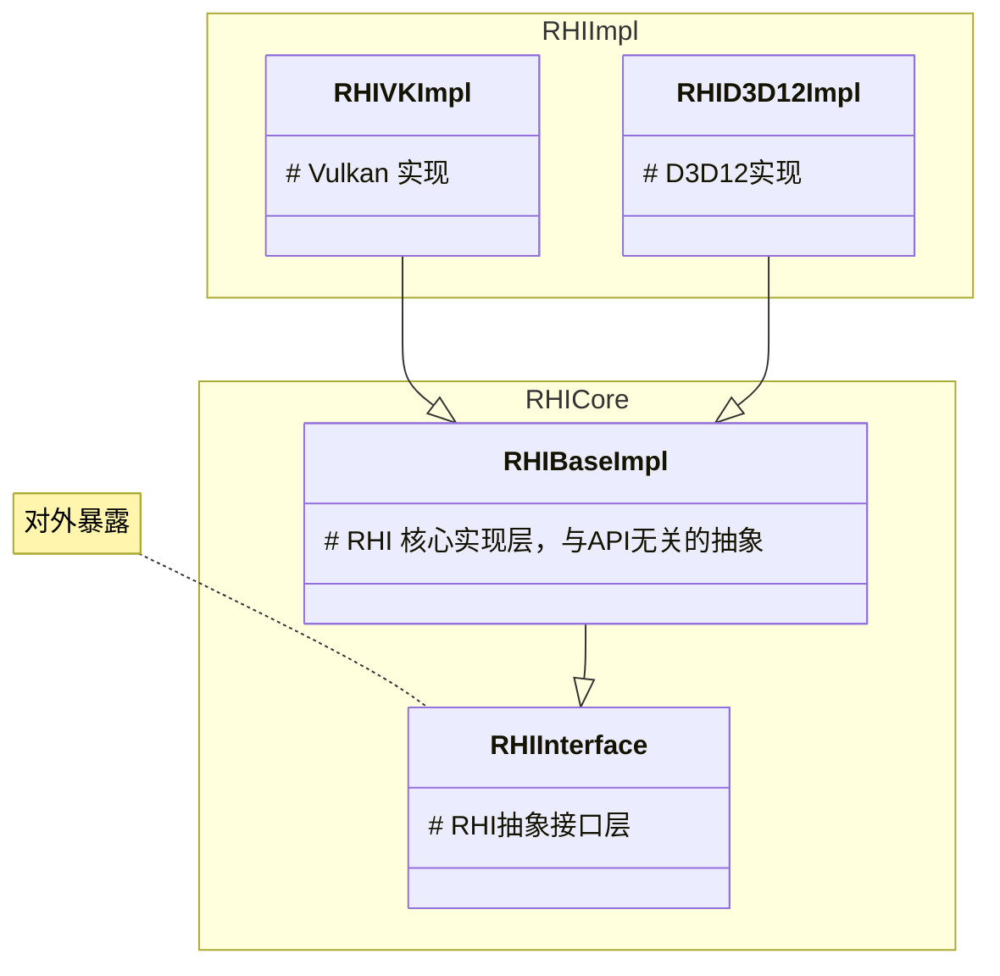

# RHI层设计
## 分层结构

```mermaid
classDiagram
direction TB
namespace RHIImpl{
    class RHIVKImpl{
        # Vulkan 实现
    }

    class RHID3D12Impl{
        # D3D12实现
    }
}

namespace RHICore{
    class RHIBaseImpl{
        # RHI 核心实现层，与API无关的抽象
    }

    class RHIInterface{
        # RHI抽象接口层
    }
}
note for RHIInterface "对外暴露"

RHIVKImpl --|> RHIBaseImpl
RHID3D12Impl --|> RHIBaseImpl
RHIBaseImpl --|> RHIInterface
```
RHI分三层设计：
- Interface层对外暴露高度抽象，外层无法接触到其它层。
- RHIBaseImpl层在Core中与API无法，主要用来实现一些通用逻辑和代码，比如BaseRenderDevice中的创建资源，资源绑定等相关逻辑。
- RHIImpl则是各种API的具体实现，为了实现多种API兼容，这里应该高度聚合