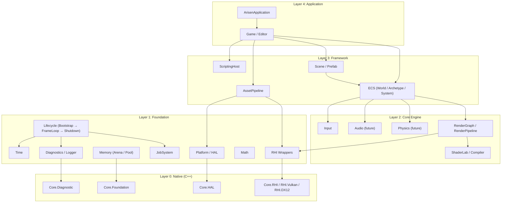
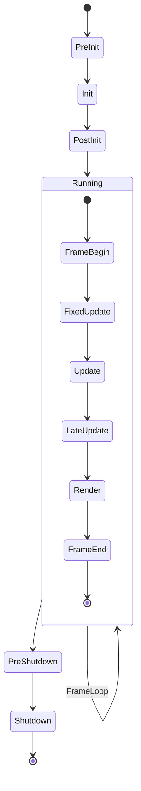
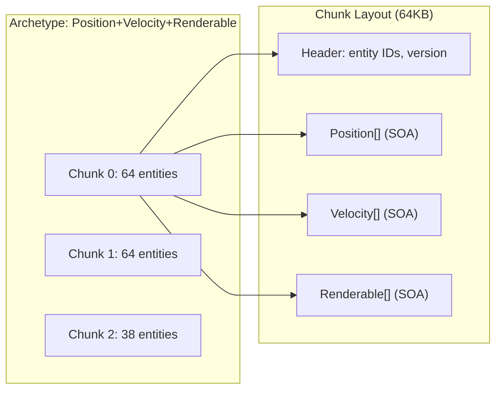

# ArisenEngine C# 架构设计

## 概述

本文档基于现有 Roadmap 和 [rhi_deep_dive.md](file:///d:/EngineSource/ArisenEngine/Engine/Arisen/rhi_deep_dive.md) 中的愿景，为 C# Engine 层设计一个**面向数据驱动、高性能**的架构。核心原则：

- **数据与逻辑分离** — 所有游戏状态存储在连续内存的 Component 数据中，System 只读写数据
- **零分配帧循环** — 帧内使用 Arena 分配器，避免 GC 压力
- **多线程 Job 调度** — 帧工作以 DAG 形式描述，自动并行化
- **分层解耦** — C++ 只提供 RHI/HAL/Diagnostic，C# 管理所有 Gameplay 和 Rendering 逻辑

---

## 1. 模块分层



### 层级职责

| 层 | 职责 | 关键特征 |
|---|---|---|
| **Layer 0** | C++ native 高性能底层 | P/Invoke 边界，AutoBinding 生成 |
| **Layer 1** | C# 基础设施 | 无业务逻辑，纯工具性质，所有上层模块的依赖基础 |
| **Layer 2** | 引擎核心系统 | 与具体游戏无关的渲染、物理、音频等子系统 |
| **Layer 3** | 高层框架 | ECS、场景管理、资产管线等面向内容创作的抽象 |
| **Layer 4** | 应用入口 | [ArisenApplication](file:///d:/EngineSource/ArisenEngine/Engine/Arisen/Engine/Core/Lifecycle/ArisenApplication.cs#19-64)、编辑器 Shell、独立游戏运行时 |

---

## 2. Lifecycle 重新设计

当前的 Lifecycle 模块（[Bootstrap.cs](file:///d:/EngineSource/ArisenEngine/Engine/Arisen/Engine/Core/Lifecycle/Bootstrap.cs) / [EngineInstance.cs](file:///d:/EngineSource/ArisenEngine/Engine/Arisen/Engine/Core/Lifecycle/EngineInstance.cs) / [ArisenApplication.cs](file:///d:/EngineSource/ArisenEngine/Engine/Arisen/Engine/Core/Lifecycle/ArisenApplication.cs)）存在以下问题：

1. 初始化逻辑大量被注释，[Bootstrap](file:///d:/EngineSource/ArisenEngine/Engine/Arisen/Engine/Core/Lifecycle/Bootstrap.cs#7-61) 直接返回 true
2. 主循环 `while(m_IsRunning)` 是单线程阻塞式
3. 缺乏明确的引擎生命周期阶段定义
4. 没有 System 注册 / 更新顺序管理

### 2.1 引擎生命周期阶段



### 2.2 核心类型设计

```csharp
namespace ArisenEngine.Core.Lifecycle;

/// 引擎运行阶段
public enum EnginePhase
{
    None,
    PreInit,      // Native DLL 加载、Logger 初始化
    Init,         // RHI、JobSystem、MemoryManager 初始化
    PostInit,     // AssetPipeline、ScriptingHost、默认 World 创建
    Running,      // 帧循环
    PreShutdown,  // 清理 World、释放 GPU 资源
    Shutdown      // Native shutdown、日志 flush
}

/// 子系统接口 — 所有引擎模块的标准契约
public interface IEngineSubsystem : IDisposable
{
    /// 初始化优先级（越小越先）
    int Priority { get; }
    
    /// 在哪个阶段初始化
    EnginePhase InitPhase { get; }
    
    void Initialize();
    void Shutdown();
}

/// 可参与帧更新的子系统
public interface ITickableSubsystem : IEngineSubsystem
{
    void Tick(float deltaTime);
}

/// 引擎内核 — 全局单例，管理所有子系统的生命周期
public sealed class EngineKernel
{
    public static EngineKernel Instance { get; }
    
    public EnginePhase CurrentPhase { get; }
    public EngineConfig Config { get; }
    
    // 子系统注册/查询
    public void RegisterSubsystem<T>(T subsystem) where T : IEngineSubsystem;
    public T GetSubsystem<T>() where T : IEngineSubsystem;
    
    // 生命周期
    public void Initialize(EngineConfig config);
    public int Run();                // 进入帧循环，阻塞直到退出
    public void RequestShutdown();
}
```

### 2.3 帧循环设计（Job-based）

```csharp
/// 帧调度器 — 每帧构建 Job DAG 并提交到 JobSystem
internal sealed class FrameScheduler
{
    // 一帧的工作流程
    internal void ExecuteFrame(float deltaTime)
    {
        // Phase 1: 固定时间步
        var fixedUpdateJob = JobSystem.Schedule(
            () => ECSWorld.RunFixedUpdateSystems(Time.fixedDeltaTime));
        
        // Phase 2: 常规更新（依赖 Phase 1）
        var updateJob = JobSystem.Schedule(
            () => ECSWorld.RunUpdateSystems(deltaTime), 
            dependsOn: fixedUpdateJob);
        
        // Phase 3: 渲染准备（依赖 Phase 2），可与 LateUpdate 并行
        var cullingJob = JobSystem.Schedule(
            () => RenderPipeline.Cull(), 
            dependsOn: updateJob);
        
        var lateUpdateJob = JobSystem.Schedule(
            () => ECSWorld.RunLateUpdateSystems(deltaTime), 
            dependsOn: updateJob);
        
        // Phase 4: 渲染提交（依赖 Phase 3 全部完成）
        var renderJob = JobSystem.Schedule(
            () => RenderPipeline.Render(),
            dependsOn: JobHandle.CombineDependencies(cullingJob, lateUpdateJob));
        
        // Phase 5: 帧结束
        renderJob.Complete();
        
        // 处理帧尾工作：销毁队列、事件分发等
        DeferredActions.Flush();
    }
}
```

---

## 3. 数据驱动核心 — ECS

### 3.1 Archetype 存储模型

所有 Component 数据按 **Archetype**（组件类型集合的签名）分组存储在连续内存块中：



### 3.2 核心类型

```csharp
namespace ArisenEngine.ECS;

/// Component 只是纯数据 struct
public interface IComponentData { }

/// 示例组件
public struct Position : IComponentData { public Vector3 Value; }
public struct Velocity : IComponentData { public Vector3 Value; }
public struct LocalToWorld : IComponentData { public Matrix4x4 Value; }

/// System 描述对数据的读写模式
public abstract class SystemBase : ITickableSubsystem
{
    /// 声明查询，由调度器分析依赖
    protected EntityQuery Query<T1, T2>()
        where T1 : unmanaged, IComponentData
        where T2 : unmanaged, IComponentData;
    
    /// 帧更新 — 内部自动并行化各 Chunk
    protected abstract void OnUpdate(float dt);
}

/// 查询结果 — 零分配遍历
public ref struct EntityQuery<T1, T2>
    where T1 : unmanaged, IComponentData
    where T2 : unmanaged, IComponentData
{
    public void ForEach(RefAction<T1, T2> action);
    public JobHandle ScheduleParallel(RefAction<T1, T2> action);
}

/// World 持有所有 Archetype 和 System
public sealed class World : IDisposable
{
    public Entity CreateEntity(params ComponentType[] types);
    public void DestroyEntity(Entity entity);
    public ref T GetComponent<T>(Entity entity) where T : unmanaged, IComponentData;
    public void AddSystem<T>() where T : SystemBase, new();
}
```

### 3.3 System 执行顺序

System 按 Group 分组，Group 之间串行，Group 内部可并行：

```
[FixedUpdate Group] (物理、碰撞检测)
    → [Update Group] (游戏逻辑、AI、动画)
        → [LateUpdate Group] (相机跟随、后处理准备)
            → [Render Group] (可见性剔除 → 渲染提交)
```

---

## 4. RenderGraph 系统

当前的 [RenderPipeline](file:///d:/EngineSource/ArisenEngine/Engine/Arisen/Engine/Rendering/RenderPipeline.cs#3-23) / [RenderPipelineManager](file:///d:/EngineSource/ArisenEngine/Engine/Arisen/Engine/Rendering/RenderPipelineManager.cs#4-83) 是直接命令式调用。改为声明式 **Render Graph**：

```csharp
namespace ArisenEngine.Rendering;

/// 声明式渲染图，自动管理资源生命周期和同步屏障
public sealed class RenderGraph : IDisposable
{
    /// 添加一个渲染 Pass
    public RenderGraphBuilder AddRenderPass(string name, Action<RenderGraphContext> execute);
    
    /// 添加一个计算 Pass
    public RenderGraphBuilder AddComputePass(string name, Action<RenderGraphContext> execute);
    
    /// 声明临时纹理（帧内复用）
    public TextureHandle CreateTransientTexture(TextureDesc desc);
    
    /// 编译并执行整个图
    public void Execute();
}

/// 用法示例
public class ForwardRenderPipeline : RenderPipeline
{
    protected override void Render(RenderGraph graph, Camera[] cameras)
    {
        var depthBuffer = graph.CreateTransientTexture(new TextureDesc(/*...*/));
        
        // 1. Depth Pre-Pass
        graph.AddRenderPass("DepthPrePass", ctx =>
        {
            ctx.SetRenderTarget(depthBuffer);
            ctx.DrawRenderers(/*opaque, depth-only*/);
        });
        
        // 2. Lighting Pass (reads depth, writes to color)
        var colorTarget = graph.CreateTransientTexture(/*...*/);
        graph.AddRenderPass("ForwardLighting", ctx =>
        {
            ctx.ReadTexture(depthBuffer);
            ctx.SetRenderTarget(colorTarget);
            ctx.DrawRenderers(/*opaque, lit*/);
        });
        
        // 3. Post Processing
        graph.AddComputePass("PostProcess", ctx =>
        {
            ctx.ReadTexture(colorTarget);
            ctx.WriteTexture(ctx.BackBuffer);
        });
        
        graph.Execute(); // 自动插入 barriers, 管理 transient memory
    }
}
```

---

## 5. 内存管理

### 5.1 帧 Arena 分配器

```csharp
namespace ArisenEngine.Core.Memory;

/// 帧生命周期的线性分配器，帧末自动清空
public sealed class FrameArena
{
    public Span<T> Alloc<T>(int count) where T : unmanaged;
    public void Reset(); // 每帧结束时调用
}

/// 全局内存工具
public static class MemoryManager
{
    public static FrameArena FrameArena { get; }         // 帧级临时分配
    public static NativePool<T> CreatePool<T>(int cap);  // 固定大小对象池
}
```

### 5.2 NativeArray — 连续非托管内存

```csharp
/// 非托管连续数组，适用于 Job 和 GPU upload
public struct NativeArray<T> : IDisposable where T : unmanaged
{
    public int Length { get; }
    public ref T this[int index] { get; }
    public Span<T> AsSpan();
    public void Dispose(); // 归还到 Pool 或直接释放
}
```

---

## 6. JobSystem

```csharp
namespace ArisenEngine.Core.Jobs;

/// Job 接口 — 值类型，零分配
public interface IJob
{
    void Execute();
}

/// 可并行的批处理 Job
public interface IJobParallelFor
{
    void Execute(int index);
}

/// Job 调度器
public static class JobSystem
{
    public static int WorkerThreadCount { get; }
    
    public static JobHandle Schedule<T>(T job, JobHandle dependency = default)
        where T : struct, IJob;
    
    public static JobHandle ScheduleParallel<T>(T job, int count, int batchSize,
        JobHandle dependency = default)
        where T : struct, IJobParallelFor;
}

/// 句柄 — 用于表达依赖关系
public struct JobHandle
{
    public bool IsCompleted { get; }
    public void Complete();
    public static JobHandle CombineDependencies(JobHandle a, JobHandle b);
}
```

---

## 7. 新目录结构

```
Engine/
├── ArisenEngine.csproj
├── GlobalUsings.cs
│
├── Core/
│   ├── Diagnostics/        Logger, Profiler
│   ├── Jobs/               JobSystem, JobHandle, IJob
│   ├── Lifecycle/           EngineKernel, EnginePhase, IEngineSubsystem
│   ├── Math/               Mathf, Color, MathTypes
│   ├── Memory/             FrameArena, NativeArray<T>, MemoryManager
│   ├── RHI/                RHI wrappers（现有 + 改进）
│   └── Time/               Time（从 Lifecycle 分离）
│
├── ECS/
│   ├── Archetype/          ArchetypeStorage, Chunk
│   ├── Components/         IComponentData, 内置组件
│   ├── Entities/           Entity, EntityManager, World
│   └── Systems/            SystemBase, SystemGroup, EntityQuery
│
├── Platform/
│   ├── Common/             FileSystem
│   ├── Desktop/            Win32, Linux
│   └── Interfaces/         IRenderSurface, IMessageHandler
│
├── Rendering/
│   ├── Graph/              RenderGraph, RenderGraphBuilder
│   ├── Pipeline/           RenderPipeline, RenderPipelineAsset
│   ├── Resources/          Mesh, VertexBuffer, IndexBuffer, ConstantBuffer
│   └── Shaders/            ShaderCompiler, ShaderLabParser, Lexer
│
├── Resources/
│   ├── AssetPipeline/      AssetLoader, AssetDatabase
│   ├── Models/             Scene, World
│   └── Serialization/      ProjectSettings
│
└── Scripting/              (future) 热重载、用户脚本宿主
```

---

## 8. 实施路线

与 Roadmap 对齐，分 4 个迭代阶段：

### Phase A — Foundation（对应 Roadmap Phase 2）
- [x] RHI 绑定已基本完成
- [ ] 实现 `EngineKernel` + 新 Lifecycle 流程
- [ ] 实现 `JobSystem`（基于 `ThreadPool` 或自定义 Worker）  
- [ ] 实现 `FrameArena` + `NativeArray<T>`
- [ ] 修复 code review 中的严重和中等问题

### Phase B — ECS Core（对应 Roadmap Phase 4）
- [ ] 实现 [World](file:///d:/EngineSource/ArisenEngine/Engine/Arisen/Engine/Resources/Models/World.cs#3-17) / `Entity` / `Archetype` / `Chunk`
- [ ] 实现 `SystemBase` + `EntityQuery`
- [ ] 实现 `SystemGroup` 自动排序与并行调度
- [ ] 移植现有 [Camera](file:///d:/EngineSource/ArisenEngine/Engine/Arisen/Engine/Rendering/Camera.cs#11-59) 到 ECS 组件

### Phase C — RenderGraph（对应 Roadmap Phase 3）
- [ ] 实现 `RenderGraph` + 自动 barrier 插入
- [ ] 实现 Transient Resource 池
- [ ] 迁移现有 [RenderPipeline](file:///d:/EngineSource/ArisenEngine/Engine/Arisen/Engine/Rendering/RenderPipeline.cs#3-23) 到 RenderGraph 模式
- [ ] Descriptor Buffer / Bindless 集成

### Phase D — Content Pipeline（对应 Roadmap Phase 4-5）
- [ ] `AssetPipeline` — 多线程资产加载
- [ ] `ScriptingHost` — C# 用户脚本热重载
- [ ] Editor 集成

---

## 9. 验证计划

### 自动化测试
- 为 `EngineKernel` Lifecycle 编写单元测试：验证阶段转换、子系统初始化/销毁顺序
- 为 `JobSystem` 编写并发正确性测试
- 为 ECS [World](file:///d:/EngineSource/ArisenEngine/Engine/Arisen/Engine/Resources/Models/World.cs#3-17) 编写 entity 创建/销毁/查询性能基准测试

### 手动验证
- 使用现有 `NativeEngineTest` 验证 RHI 绑定仍然正常
- 运行 Editor（`ArisenEditor.Desktop`）确认不影响现有功能
