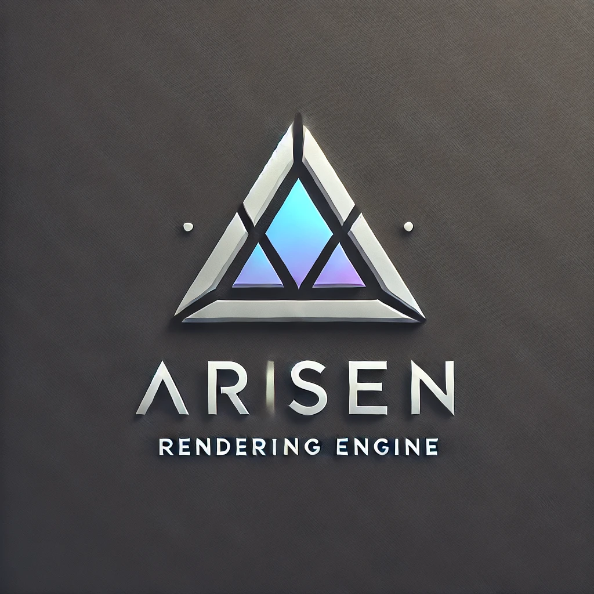

# NebulaEngine

## Intro

## Content

### Setup

#### Environment Setup
- value environment variable "NEBULA_SOLUTION_ROOT" path to Nebula.sln like "D:/Project/Engine/Nebula"
- value environment variable "VK_SDK_PATH" path to Vulkan SDK location, if vk sdk installing program doesn't set it automaticlly 

## Roadmap

### Editor
<!-- Editor Startup -->
- [x] Splash Window 
- [x] Start-up Window
- [ ] Project List Show
- [ ] Open Project
- [ ] Add Project
- [ ] Create Project
- [ ] Import Template

<!-- Editor Main Windows -->
- [ ] Windows Floating

<!-- Assets Processing -->
- [ ] Assets DataBase
- [ ] Assets Importing

<!-- DebugSettings -->

- [ ] API Debug Validation Switcher

### Core.Rendering

<!-- Render Pipeline Framework -->
- [ ] Scriptable Render Pipeline
- [ ] Multiple Pipelines
- [ ] Multiple Cameras
- [ ] Render Graph Support
- [ ] CPU Camera Culling
- [ ] Static Batching
- [ ] GPU Instancing
- [ ] SRP Batching

<!-- Shading -->

<!-- Graphics API Support -->
- [ ] Vulkan API
- [ ] Metal API
- [ ] DX12 API
- [ ] OpenGL API

### Core.Thread

### Core.Container

### Engine

### Serialization

## Samples
